# 区块链技术与应用

[TOC]

---

## BTC-密码学原理

### (1)cryptographic hash function

- collision resistance
- hiding 单向不可逆

上述两种性质可以实现digital commitment或者digital equivalent of a sealed envelope (sealed envelop：预测可能会对结果产生影响，因此可以将$H(x)$作为预测值公布，之后验证$x$，实际操作的时候用的是$H(x||nonce)$来保证均匀分布)

BTC使用的hash (SHA-256, Secure Hash Algorithm) 还有一个性质：

- puzzle friendly (difficult to solve, but easy to verify)

    挖矿就是一直试不同的$nonce$使得$H(block~header)\le target$即为合法值，这个词表示必须通过遍历来试——工作量证明proof of work

### (2)非对称加密

**账户管理**

开户的过程：创建一个公钥和私钥 `(public key, private key)`

加密和解密用的都是接收方的，公钥加密私钥解密

公钥：账号；私钥：密码

BTC交易时用私钥来做签名，其他人用公钥解密验证

假设产生公私钥的过程使用的是好的随机元 a good source of randomness


比特币 对一个message取hash，再对hash签名

---

## BTC-数据结构

### (1)Hash pointers

保存结构体首地址和其hash值

如果有环的话，就产生问题，导致无限hash计算下去

### (2)Blockchain

Block chain is a linked list using hash pointers.相对于传统链表，使用hash pointer 代替传统pointer

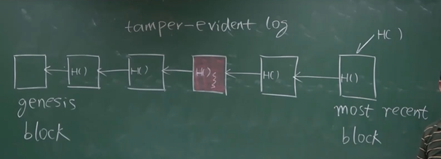

第一个区块叫genesis block，最后一个区块是most recent block，由hash pointer连接起来，注意hash值是对前一个区块整体取hash得到的——>tamper-evident log(篡改证明记录,只需检测最后一个hash,即可检测)

节点不需要维护所有区块，仅需维护最近区块

### (3)Merkle Tree

和Binary Tree的区别是用hash pointer代替binary tree的指针

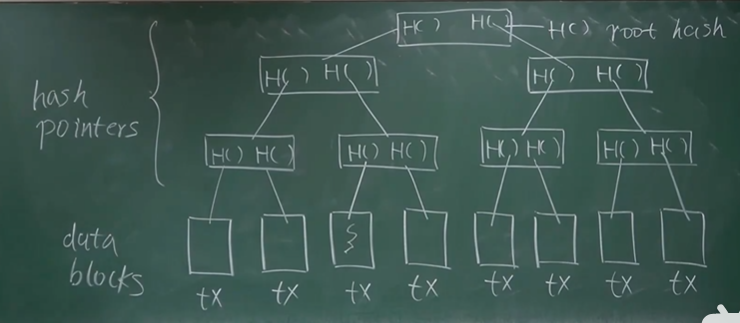

内部节点都是hash pointer，leaf是data block（交易数据transaction），对根节点取hash就是root hash

- block header => 交易的根hash
- block body =>交易列表

BTC有两种节点：全节点（保存block header和block body）和轻节点（只保存block header），Merkle Tree提供了Merkle proof

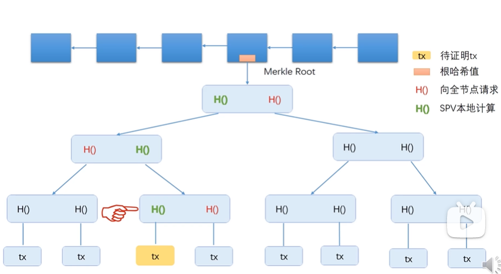

proof of membership (inclusion) 复杂度 $\Theta(\log n)$

proof of non-membership (non-membership)：将leaf按照hash值排序，然后对需要被验证的transaction取hash看位于哪两个leaf之间，只要能证明这两个leaf能够推到root正确即可。验证复杂度 $\Theta(\log n)$，需要排序的称为Sorted Merkle Tree但是BTC不需要验证non-membership

---

## BTC-协议

---

### (1)验证交易合法性

数字货币存在**double spending attack**(数字货币相当于一个文件，可复制啊)

- 中心化方案：每个数字货币设有编号，央行维护数据库，记录 编号<=>user,使用时，验证央行数字签名，并向央行核实。央行需要掌握所有货币动向，太麻烦😔
- 去中心化方案：数字货币发行？**挖矿**     验证交易有效性？

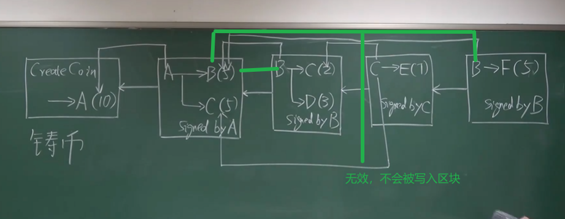

区块链：每个交易要包含输入和输出，输入包含币的来源——铸币交易coinbase transaction（使用hash指针）以及**转账人的公钥**，输出包含收款人公钥的hash(地址)，还需要转账人的签名

- hash指针： 连接区块 | 币的来源(证明币非凭空捏造，防双花)
- 比特币钱包中公钥伪512位，通过计算hash获取一个160位地址

每个节点都需要知道转账人的公钥，因为交易签名使用的是转账人的私钥，大家验证需要使用其公钥验证合法性

**铸币交易的输出包含获得人的公钥的hash，后续交易的输入公钥需要和最初的coinbase交易的公钥对得上**

实际上BTC上每个区块链上都也很多交易组成Merkle Tree

---

### (2)区块组成

每个区块分成Block header和Block body

| Block header                                                 | Block body       |
| ------------------------------------------------------------ | ---------------- |
| version                                                      | transaction list |
| hash of previous block header <br/>(only caculate block header) |                  |
| Merkle root hash                                             |                  |
| target (挖矿难度目标预值)<br/>nBits（256位target的压缩编码 4bytes） |                  |
| nonce                                                        |                  |

BTC每个节点可分为full node (fully validating node) 和 light node (只保存block header)，主要是后者

---

### (3)共识机制

账本内容要取得分布式的共识distributed consensus，共同维护distributed hash table

有人提出FLP impossibility result，即在一个异步且时延没有上限的网络中，只要有一个人是faulty，整个网络就无法达成共识；另外有人提出CAP Theorem (Consistency, Availability, Partition tolerance)，即这三个性质最多得到两个

cap理论

BTC的共识协议：

若采用简单投票，需要确定membership（如hyperledger fabric联盟链，只有某些大公司能参与，投票可以），BTC中恶意者不断产生公私钥就一直获得投票权sybil attack(女巫攻击)。  

比特币投票机制为算力  hash rate，创建账户并不能改变投票权重

**在BTC中，$H(block~header)\le target$中有一个4bytes的$nonce$，求出符合该式的$nonce$即可获得记账权，其他节点接收到区块需要验证区块合法性(blockheader blockbody->tx)**


当hash of previous block header不是指向longest valid chain的最后的时候，这个区块就新开了一个分支（分叉攻击forking attack），正常情况应该是接在最长合法链的后面。

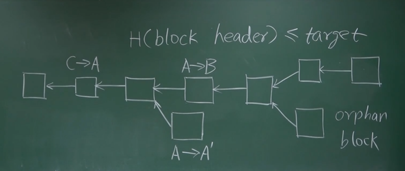

但是还有一种情况，两个区块同时获得记账权，都接在longest valid chain的最后产生分叉，此时各个本地区块会根据网络延迟先接上两者之一。之后如果在两者其中之一继续先扩展下一个区块（看算力和运气）就变成了最长合法链，另外一个就变成了orphan block被丢弃掉

---

### (4)铸币方式

BTC设置block reward来让大家争夺记账权，因为这是铸币(**coinbase transaction**)的唯一方式

50BTC  ——>  25BTC  ——> 12.5BTC   (每产生21万个区块 ，出块奖励减半)

---

## BTC-系统实现

BTC：transaction-base ledger (基于交易的账本，比特币中每个账户不会显式指定余额，通过交易输入输出)

ETH：account-based ledger   系统显式地记录每个账户上的币

全节点在内存中维护UTXO (Unspent Transaction Output，所有未交易的输出组成的集合)。每个UTXO需要给出产生输出交易的hash，以及在交易中是第几个输出，进而定位交易中UTXO的输出。快速检测double spending

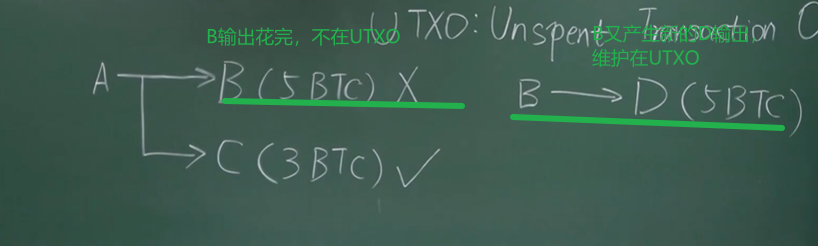

`total inputs == total outputs`

除了出块奖励之外，为了防止某人在打包区块链的时候只打包自己的交易记录，于是提供了transaction fee作为奖励

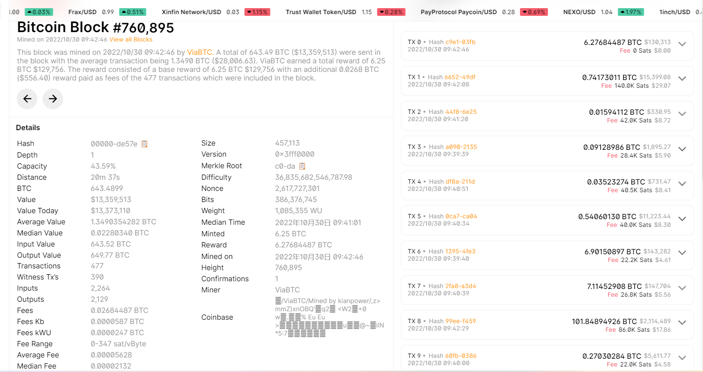


block header data structure

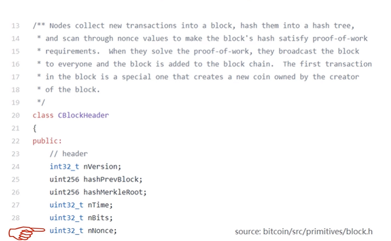


为了增大nonce(2^32)的搜索空间，可以使用coinbase txn的前几个字节作为extra nonce，因为coinbase txn的内容是随意的但是修改它会导致Merkle Tree Root的hash值发生改变,(真正挖矿时有两层循环，外层循环调整coninbase 的extra nonce ,算出block header 的root hash,内层循环调整blockheader的nonce)

注意下图拼接的tx信息为 Merkle Tree root hash, 并非实际的交易信息

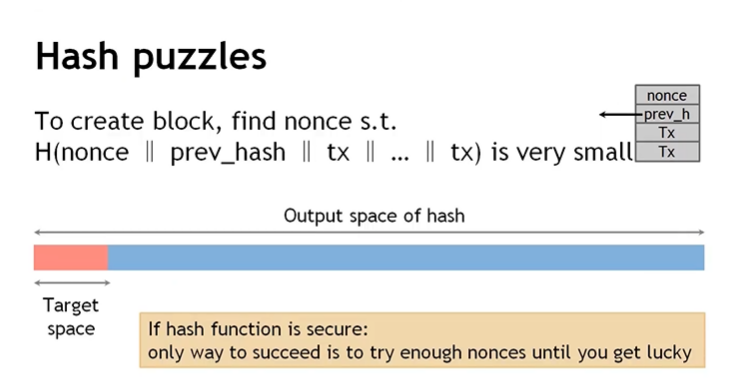

尝试nonce成功是伯努利过程(Bernoulli trail： a random experiment with binary outcome,Bernoulli process： asequence of independent Bernoulli trails)，接近于Possion分布，无记忆性（memoryless将来挖的时间和过去挖的时间没有关系），系统平均出块时间为10min


BTC的数量(geometric series)：
$$
210000*50+210000*25+\dots\\=210000*50*(1+\frac12+\frac14+\dots)=21000000
$$
挖矿求解过程没有意义，但是Bitcoin is secured by mining：当大部分算力掌握在诚实节点上的时候就是安全的（用算力投票）

记账权的获得有时候看运气，所以可能会落入恶意节点，此时

- 不能偷币（因为没有转账人的私钥签名，即使写到链上，诚实节点不会接受区块(包含非法交易)，会继续向下挖，它不是最长**合法**链所以诚实节点不会接上去，所以此恶意攻击者甚至拿不到出块奖励

- 可能出现double spending——难度较大（forking attack，同时写入转账和回滚产生分支，交易平台看到写入转账的区块就认为交易成功，但是之后可能回滚分支成为最长合法链，如果本来转账分支之后就已经接着很多区块了，这种方法就比较困难，所以BTC的防范方法是six confirmation，需要1小时时间，故BTC的不可篡改性是概率上的保证；另一种方法是zero confirmation，直接选择最先被接受的节点，或者电商平台本来交易完到发货就有时间差可以用来检验合法性）

- 注意bitcoin 可以解决买家欺骗卖家，无法解决卖家欺骗买家问题

    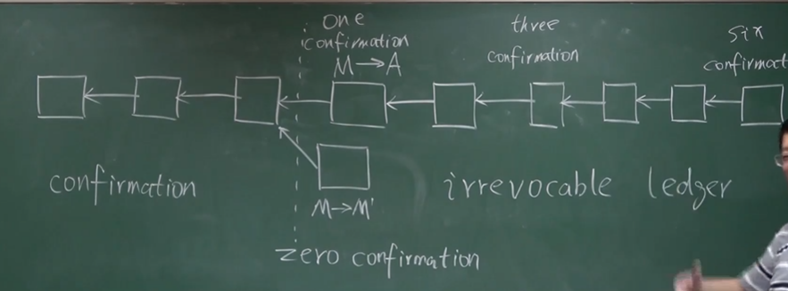

- 故意不包含合法交易，但是总有合法的区块会发布这些交易

- selfish mining——正常情况下挖到区块直接发布，但是也可以挖到多块区块连在一起然后forking attack一次性接上去。但是前提是恶意算力比较大的时候才比较容易成功篡改。但是这种方法也有好处(单纯赚取出块奖励，先挖一个不发布，再挖下一个，然后抢先发布)，减少竞争，关键还是需要算力比较大，风险在于连续先于其他人完成挖矿的概率很低

---

## BTC-网络

BTC工作在application layer，底层network layer是P2P Overlay Network，在这个网络里所有节点都是平等的，没有super node/master node，加入网络需要知道seed node(种子节点),然后与之连线，节点间通过tcp通信

**BTC网络的目标：**简单，鲁棒(robust)而不是高效(efficient),每个节点维护邻居节点(随机，不受底层拓扑结构影响)的集合，消息在网络中传播采取flooding的方式(节点第一次收到消息，转发，同时记录消息已经收到，下次再收到时，不用再转发)

比特币系统中维护一个等待写入链上交易的集合，第一次收到，转发(合法)，以后再收到时，就不会再转发，避免在网络上无限传输下去

BTC协议对区块大小的限制为1M

best effort，一个交易不一定让所有节点都收到，顺序也不一定一样，有些节点可能转发错误的交易

---

## BTC-挖矿难度的调整

$difficulty=\frac{difficulty\_1\_target}{target}$

分子是当难度为1（最低）的时候的目标阈值，是一个很大的数

挖矿难度低，出块时间太短导致：这个区块在网络上来不及广播，使得多分叉变成常态，一旦出现多分叉，善意的算力被分散，而恶意算力可以集中在一个分叉上使得其不断延伸成为最长合法链，使得51% attack的数字会变小

每2016个区块调整一下难度，大概是14天一次，$target=target\times \frac{actual~time}{expected~time}$

代码写在比特币源码中，验证区块时会验证目标阈值的压缩编码（nBits），恶意节点无法执行调整nBits来降低难度因为别的区块验证会通不过

比特币成功可能源于他的不太实用，设计比较保守，目前参数还算比较合理

## BTC-挖矿

### 节点构成

全节点：

- 一直在线

- 在本地硬盘中维护完整的区块链信息

- 在内存中维护UTXO集合，以便快速检验交易的正确性

- 监听比特币网络上的交易信息，验证每个交易的合法性

- 决定哪些交易会被打包到区块里

- 监听别的矿工挖出来的区块，验证其合法性

    - 交易合法（包括铸币的金额）

    - 是否符合难度要求，即block header取hash前面是否有足够多的0

        ，检查难度目标阈值是否正确

    - 是否接在最长合法链上

- 挖矿

    - 沿着哪条链
    - 等长选择哪条链挖

轻节点(Simplified Payment Verification)：

- 不是一直在线
- 不用保存整个区块链，只要保存每个区块的块头
- 不用保存全部交易，只保存与自己相关的交易
- 无法检验大多数交易的合法性，只能检验与自己相关的那些交易的合法性
- 无法检测网上发布的区块的正确性
- 可以验证挖矿的难度
- 只能检测哪个是最长链，不知道哪个是最长合法链

当监听到有人挖出一个区块之后，自己需要停止当前的挖矿然后重新打包交易、区块然后开始挖矿——并不可惜，因为无记忆性 memoryless / progress free，无论继续挖还是重挖，概率相同

比特币的安全有密码学（无法伪造签名和身份）与共识机制保证，前提大部分节点是没有恶意的


### 挖矿设备演化 


-  用笔记本CPU（内存的资源闲置） 
- GPU(通用并行计算，只利用整型计算，浮点寄存器等闲置)
- 目前挖矿常用ASIC（Application Specific Integrated Circuit）芯片，只适用于一种mining puzzle。有些币的mining puzzle会设置成和一个比较火的币一样，这种情况成为merge mining。

有人认为会违背去中心化的初衷 -> alternative mining puzzle -> ASIC resistance -> 家用计算机也可以挖矿


### 矿池

挖矿的一个趋势的大型矿池的出现

- 综合所有矿工需要10钟一个区块，单个矿工可能要1 - 2 年才可以，相当于中彩票
- 单个矿工除了挖矿还需要承担全节点的其他责任任务重（ASIC只能计算hash，无法执行区块链其他功能）
- 解决单个矿工收入不稳定问题

**pool manager： 承担全节点的其他责任（监听交易、打包区块、监听新区块产生）**

**pool miner: 只负责计算hash**

分配问题

- 大新数据中心 - 同一机构，不存在分配问题
- 分布式 (不属于同一机构)， 按照工作量大小分配
    - 降低挖矿难度 , 矿主检查每个矿工提交share、 almost valid block

矿池算力分布：数据比较老

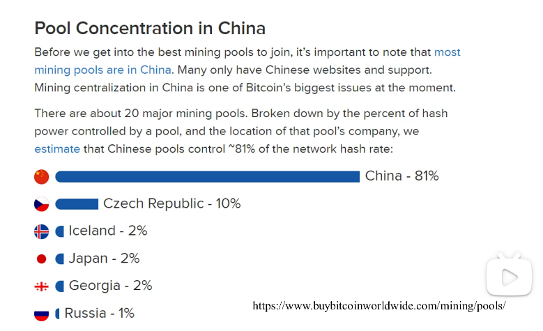


危害： 发动 51% 攻击更加容易

如果某个矿池得到51%算力，就可以使用分叉攻击、Boycott（封锁交易，所有和某人有关的交易全部回滚，不需要等待6个confirmation，这样别的矿工也会不打包和该人有关的交易，逼迫站队），但不能把别人的钱转走（因为没有别人的私钥）


## BTC-脚本 


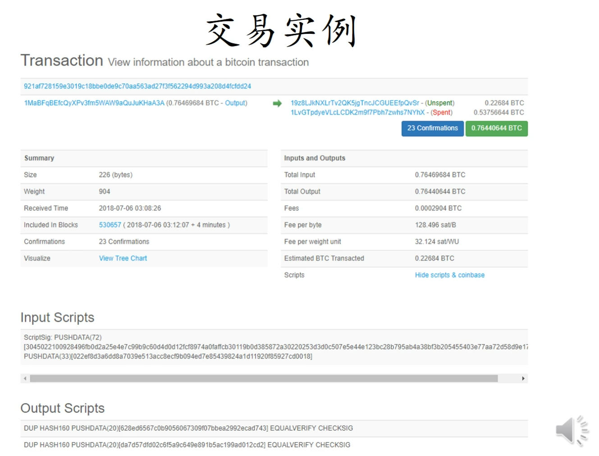


基于栈的语言(stack base language),bitcoin script 

```json
"result": {
    "txid":"921a...dd24",
    "hash":"921a...dd24",
    "version":1,
    "size":226,
    "locktime":0,//设定交易生效时间
    "vin":[...],
	"vout":[...],
	"blockhash":"00000000002c510d...5c0b",//区块hash
	"confirmations":23,//确认信息
	"time":1530846727,//交易产生时间
	"blocktime":1530846727//区块产生时间
}
// locktime为0表示立刻生效

"vin": [{
    "txid":"",//输出来源的交易的hash地址
    "vout":0,//指定来源交易的输出索引
    " ": {//inputscript
        "asm":"",
        "hex":""
    }
}]
// 上面vout的值表示是txid交易的第几个输出

"vout": [{
    "value":0.1,//输出金额 BTC
    "n":0,//表示交易的第几个输出
    "scriptPubKey": {
        "asm":"DUP HASH160 628e... EQUALVERIFY CHECKSIG",
        "hex":"76a9...",
        "reqSigs":1,
        "type":"pubkeyhash",
        "addresses":["...."]
    }
}]
// 上面n表示为当前输出的第几个，asm输出脚本的内容，reqSigs表示需要的签名数量
```

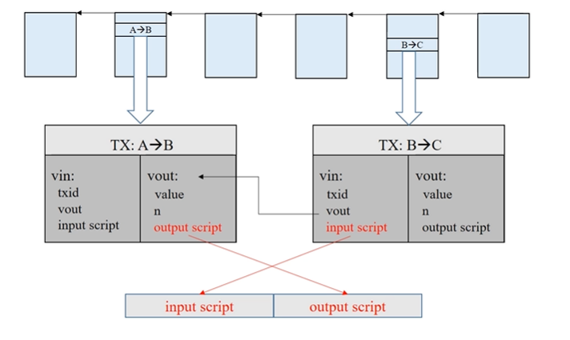

某个区块A的输入来源于区块B的输出，那么将A的input script和B的output script（注意**不是**A的output script）拼接在一起，先执行前者，后执行后者，如果结果为true就表示合法

输入输出脚本几种类型：

- P2PK (Pay to Public Key)

    - input script
        - PUSHDATA (Sig，付款人私钥对输入脚本这个交易的签名)
    - output script
        - PUSHDATA (PubKey，付款人公钥)
        - CHECKSIG(检查签名)
    - 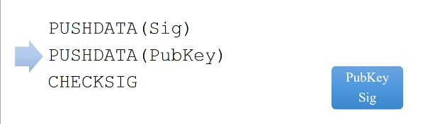
    - 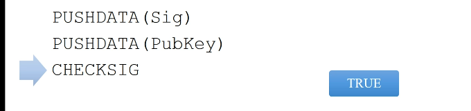
    - 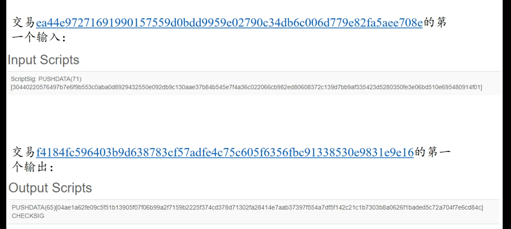

- P2PKH (Pay to Public Key Hash) 最常用

    - input script
        - PUSHDATA (Sig) 压栈
        - PUSHDATA (PubKey) 压栈
    - output script
        - DUP 复制一份栈顶并压栈
        - HASH160 弹出栈顶pubkey取hash压入栈
        - PUSHDATA (PubKeyHash) 压入pubkeyhash
        - EQUALVERIFY 弹出栈顶两个hash值是否相等，防止某人以自己的公钥顶替
        - CHECKSIG 最后将sig和pubkey进行check正确就返回true
    - 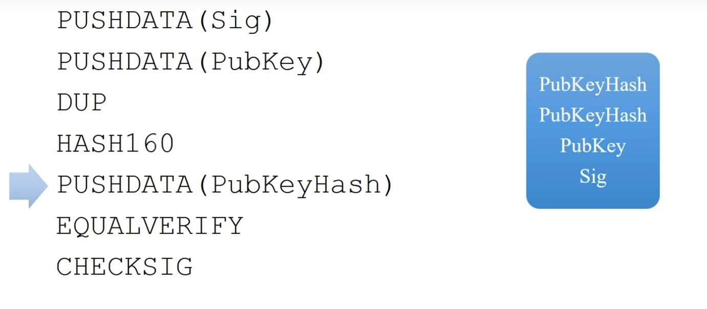
    - 

- P2SH (Pay to Script Hash)

    - input script

        - ...
        - PUSHDATA (Sig)
        - ...
        - PUSHDATA (serialized redeemScript)

    - output script

        - HASH160
        - PUSHDATA (redeemScriptHash，收款人提供的脚本的hash)
        - EQUAL

    - 简单来说就是另外有一个redeem script（赎回脚本），首先执行input和output，最后执行redeem的内容

    - 使用 P2SH 实现 P2PK

        - 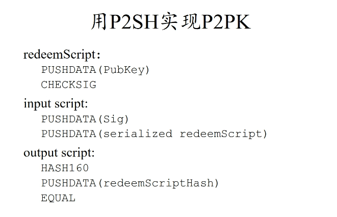

        - 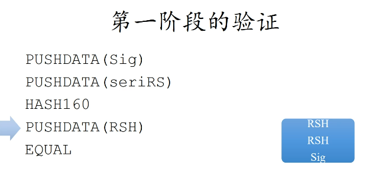

        - 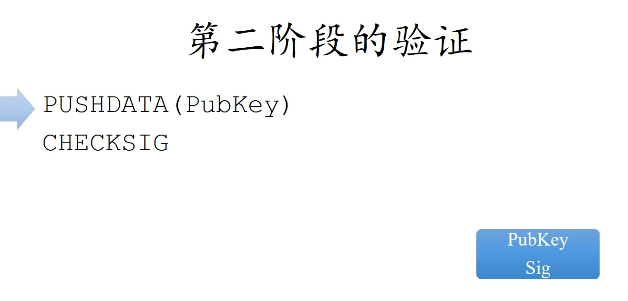

    - 支持多重签名

        -将input script中改成

        - false (Bitcoin的实现BUG，这里多压入一个没用的元素)
        - PUSHDATA (Sig_1)
        - ...
        - PUSHDATA (Sig_M)
        - PUSHDATA (serialized redeemScript)

        将redeemScript写成

        - M 表示总的签名数
        - PUSHDATA (pubkey_1)
        - ...
        - PUSHDATA (pubkey_N)
        - N
        - CHECKMULTISIG

    - 

    - 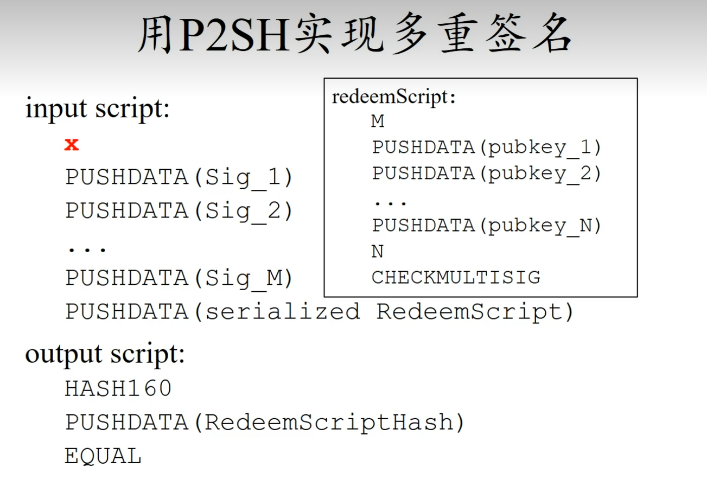

    - 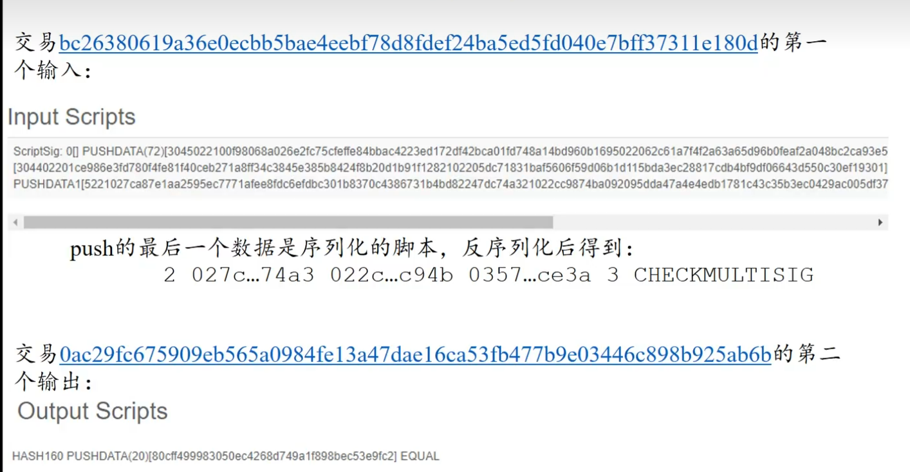

- Proof of Burn

    - output script
        - RETURN [zero or more ops or text]
        - 这种形式的output被称为Provably Unspendable/Prunable Outputs
    - 脚本说明：return直接返回false，这个output无法被花出去，UTXO可以剪枝
    - 应用
        - AltCoin (Alternative Coin) 销毁Bitcoin获得小币
        - 花费非常少的BTC将某些内容取hash放到return后面，这样就能放到区块链上 （coinbase中也是随意记东西的，但是只有获得记账权的节点才能写东西）

## BTC-分叉

- state fork  状态分叉，意见分歧
    - 包括forking attack，也被称为deliberate(蓄意) fork
- protocol fork 协议分叉
    - 不同协议造成的分叉，没有办法保证系统所有软件升级
    - 进一步分成hard fork和soft fork
    - hard fork
        - 扩展新的特性（如修改block size limit为4M）时如果不认可新的特性就会产生硬分叉
        - 旧节点在原来的链上不断延伸，新节点在新的链上延伸，产生永久性的分叉
        - 当前交易速度约为每秒7笔交易 1000000 / (250 * 60 *10) 现实中信用卡等比这高了好几个数量级
        - 由此社区分裂成两帮人，一个币拆成了两个币，各自有自己的chain id ,各有各的币
        - 必须所有节点更新才没有分叉
    - soft fork
        - 临时的分叉（如修改block size为1M）
        - 旧节点会放弃旧链，在新链上延伸，但是此时新节点又不会认当前链为最长合法链而新开一个分叉，使得旧节点一直是白挖
        - 最终还是会变成一条链
        - 例子：给原来的某些域一些新的含义，比如给coinbase域增加含义extra nonce，nonce+UTXO的根hash, P2SH
        - 系统半数节点更新即可
        - 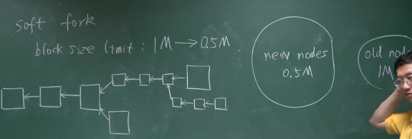

## BTC-课堂问答

- 如果收款人没有连接到BTC网络？

    - 没有关系
- OP_RETURN永远返回false为啥会写到区块链上？

    - 因为这个RETURN语句是写在output script，因此在验证这笔交易的时候并不执行
- 交易费给哪位？

    - 交易费等于总输入减总输出，剩下的直接给挖到的矿工即可

## BTC-匿名性

anonymity

pseudonymity (化名)，匿名性不如纸币高于银行

可以通过交易信息将输入输出钱包关联下来

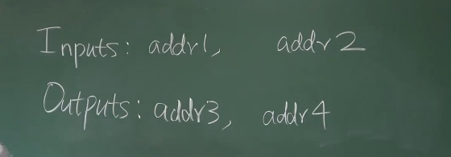

不同账户之间可以建立关联、BTC和现实世界也可以形成关联 ()

- 在network layer（P2P  ）上实现匿名性：使用TOR,中间节点只知道上一个节点转发

- 在application layer上实现匿名性：coin mixing、在线钱包本身可能带有coin mixing功能、交易所天然有coin mixing功能（如果交易所不暴露提币存币的记录）

## 补-零知识证明

证明者向验证者证明一个陈述是正确的，而无需透露该陈述是正确的外任何信息

数学基础：**同态隐藏**

- 如果$x,y$不同，那么加密函数值$E(x)$和$E(y)$也不同 
- 给定$E(x)$，很难反对出$x$的值（类似hiding）
- 同态运算：
    - 同态加法：$E(x)$  $E(y)$ => $E(x+y)$
    - 同态乘法：$E(x)$  $E(y)$ => $E(xy)$
    - 扩展到多项式

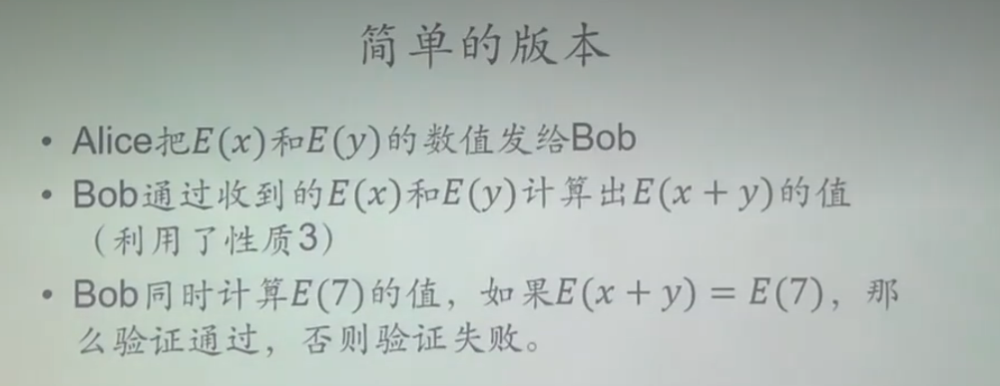

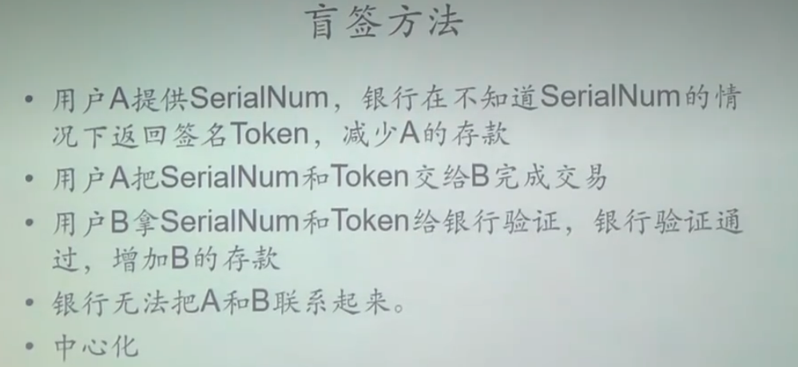

为匿名性设计的  加密货币：零币zerocoin和零钞zerocash 

- 通过零知识证明是区块链上存在的合法的币，不需要知道币的来源

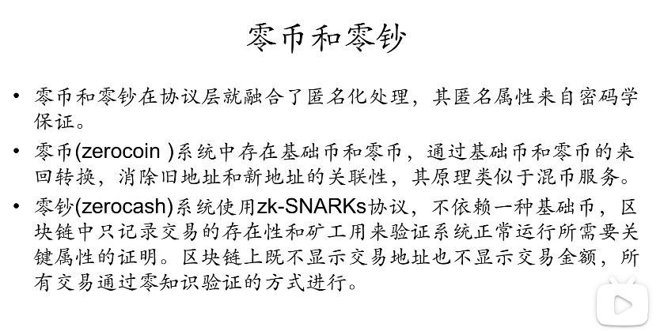

## BTC-引起的思考

- hash pointer只有本地的地址，发布到区块链网络上会咋样？

    网络上没有指针，只有hash，全节点维护一个数据库保存`(key, value)`，常用的是levelDB

- 区块恋

    共享账户不要使用截断私钥(private key破解难度大大降低，币永久保存在UTXO，对矿工不友好)，使用多重签名MULTISIG

- 分布式共识 

    BTC实际上也没有取得 真正的共识，但是实际和理论是不一样的 

    **不要被学术界的思维限制了头脑，不要被程序员的思维限制了想象力**

- 量子计算

    比特币有生之年不一定对其产生实质性威胁，首先冲击传统金融业

    - 加密 保证信息完整性

    - 取hash 会造成信息损失，没有办法逆推
    - 即使公钥也不要随便泄露

---

## ETH-概述

ETH相较于BTC创新之处：

- 出块时间 十几秒，ghost
- 重新设计了mining puzzle为memory hard（ASIC resistance）
- 将权益证明proof of stake取代工作量证明
- 支持智能合约smart contract，增加去中心化的合约支持
    - 跨国合约，没有一个统一的司法体制，通过司法维护合约有效性比较困难，通过技术手段制定规则，利用不可篡改性

## ETH-账户

BTC有找零地址，必须一次性使用之前得到的BTC，否则就会当成手续费给矿工

ETH使用account-based ledger，需要显式地记录每个账户有的ETH

对double spending attack(花钱的人不诚实)有天生的防御性

- 不用记录币的来源，花了就直接在余额中扣除即可

但会遇到replay attack(收钱的人不诚实)重放攻击：收款人将某个交易多次广播

- A->B ,B把交易多次广播，节点接受并扣除A账户余额
- 解决方法：在交易中加入nonce表示某账户的交易编号（从0到正无穷）
- 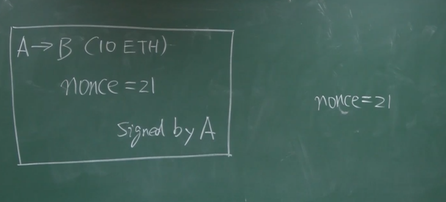

ETH中有两类账户：

- externally owned account
    - balance
    - nonce 计数器 /counter /sequence number
- smart contract account 合约账户
    - 不能主动地发起交易,所有交易必须由EOA发起，但可以调用另外一个合约
    - 除了上面两个东西之外还有：code和storage(创建合约会收到一个地址，即可调用)
    - bitcoin->隐私保护，ETH->合约->稳定的身份

## ETH-状态树

ETH账户160bit，20字节，40个十六进制数

ETH需要维护addr到state的映射    addr -> state

- 如果使用hash表(插入，更改，查询效率高)维护上述映射(将hash table中的数据维护为一颗Merkle Tree，block header 中存储Merkle root) 
    1. 使用单纯的hash表无法证明账户余额等状态是否被篡改
    2. Merkle Proof (证明账户余额)
        -  因为交易的时候state会发生改变，也就是说Merkle Proof无法成功（Merkle Tree Root是为了保证所有节点的一致性而必须使用的数据结构），内容改变必然导致Merkle Tree Root发生改变，需要重新组织Merkle Tree，而账户数量极大，重新组织代价极大  (bitcoin系统中维护交易的Merkle Tree,但上限4000个,计算成本较低)


- 如果直接使用Merkle Tree来构建
    1. 没有提供高效查找和更新的方法
    2. 如果不是sorted Merkle tree，每个全节点构建的Merkle Tree叶节点的顺序是不同，那么最后的root hash也可能不同（BTC不需要排序，最后是由获得记账权的节点决定）如果是sorted Merkle tree，新产生的节点hash之后的值一般就插在叶节点的中间导致需要重构Merkle Tree，代价太大了

**ETH使用类似trie字典树的数据结构(retrieval 检索)**

- 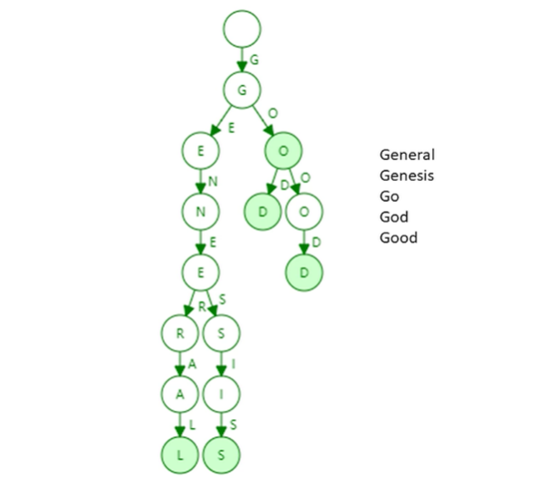

- 优点
    - 每个结点的分支数目(branching factor)取决于key的范围 +结束标志位,0 - f +结束标志符 17
    - 查找效率：取决于key长度 40 
    - 不会出现碰撞
    - 输入不变，顺序无所谓，最后输出的Trie是同一棵树
    - 更新：不用访问其他分支，也不用遍历整棵树
- 缺点
    - 存储浪费

**trie经过压缩得到Patricia Tree/Patricia Trie压缩前缀树**

- 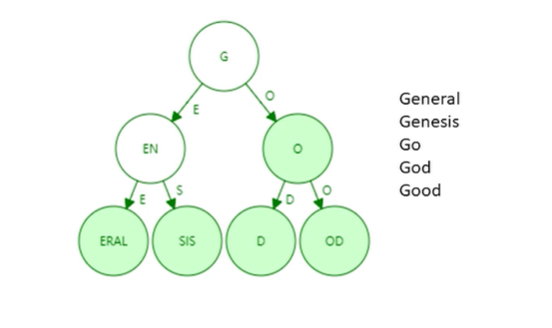
- 特点
    - 树变浅了，访问次数大幅降低
    - 新插入单词，原来的树可能会扩展开
    - 当键值稀疏的时候适合路径压缩，使用后者，而ETH非常稀疏（$2^{160}$）

**MPT：Merkle Patricia Tree，可以防篡改，Merkle Proof以及验证账户是否存在**

- 普通指针换为hash指针,存储地址转换为hash值
- root hash不变，整个账户状态都不会被篡改
- Merkle Proof  发送所在分支，证明账户余额
- 证明某个账户不存在

**ETH使用Modified MPT**

- 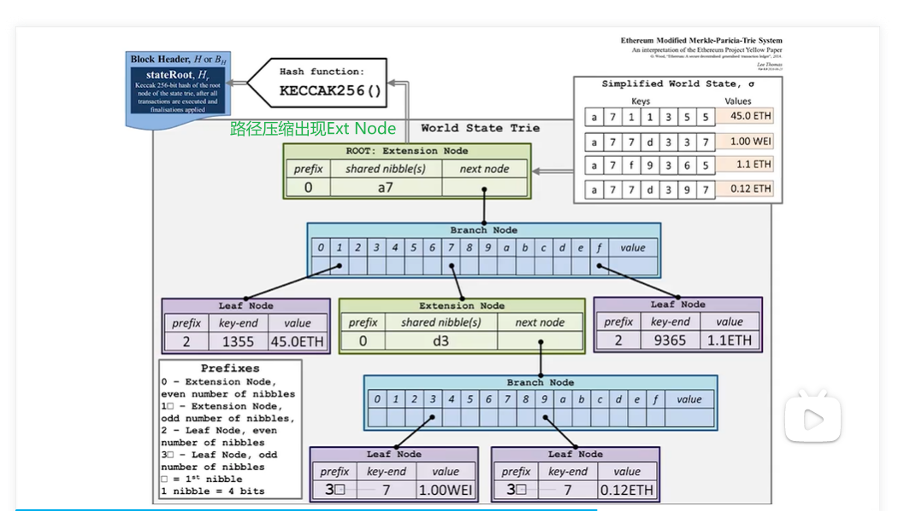

ETH每个区块都要产生一个新的MPT，但是这个MPT和之前的MPT大部分节点是相同的，只需要增加新的分支即可，不在原地改的原因：临时性分叉很常见，未胜出的节点需要roll back，同时智能合约的实现使得通过交易反推之前的状态是不可能的，所以需要保留历史信息

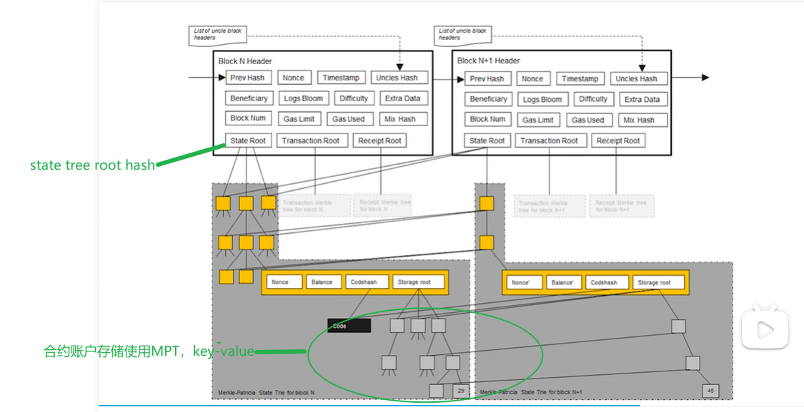

以太坊代码的数据结构

- header
    - 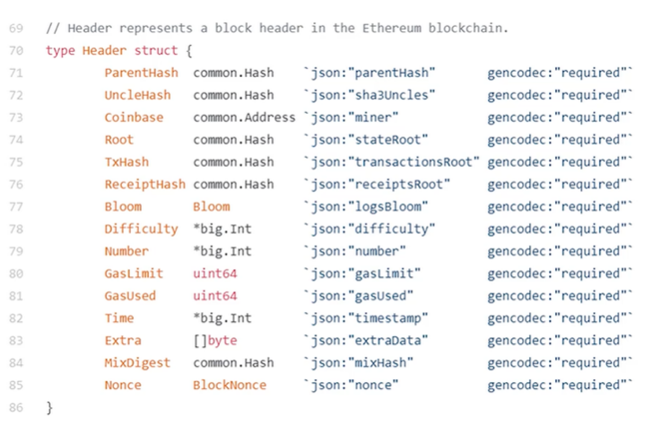

- all
    - 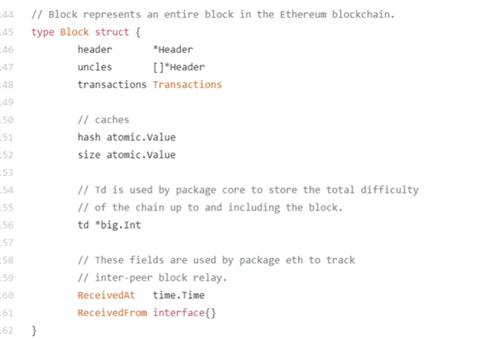

- extblock 网络上真正发布信息
    - 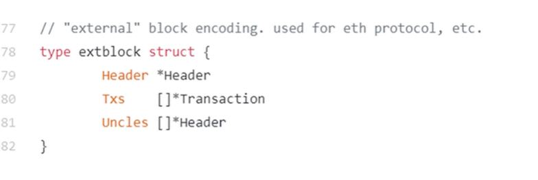

状态树中value序列化之后存储，序列化方法：Recursive Length Prefix        **RLP**(极简，仅支持 nested array of  bytes)

## ETH-交易树和收据树

每一个交易产生一个收据，记录交易的相关信息，便于快速查询执行结果

交易树和收据树都使用MPT，实际上只是便于项目管理都采用MPT，也可以只用Merkle Tree，因为这两种树都是对于某个区块建的，前者的key是在当前区块中交易序号

- MPT支持查找操作，通过键值从顶向下沿着这个数进行查找
    - 账户：key = account address
    - 交易树/收据树： key = 交易在发布区块中的信号
- 交易树和收据树只是把发布在当前区块的交易组织起来(区块与区块之间独立)，状态数要求包含系统中所有账户的状态(多个区块的状态树是共享的)
- 用途
    - tx tree：提供Merkle Proof 证明某个交易被打包到区块中
    - receipt tree：证明某个交易的执行结果

以太坊中支持更高效的查询操作

- 查询过去10天所有跟某个智能合约相关的交易信息
    - 扫描10天内所有区块的交易信息
        - 复杂度较高
        - 对于light node只有区块头的信息，不能扫描所有交易列表
- 查询过去10天符合某种类型的所有事件(众筹，发行新币)

引入**Bloom Filter**布隆过滤器来提高查询速度，但可能出现false positive假阳性，不会出现 false negative假阴性(漏报),一般的Bloom Fiter不支持删除

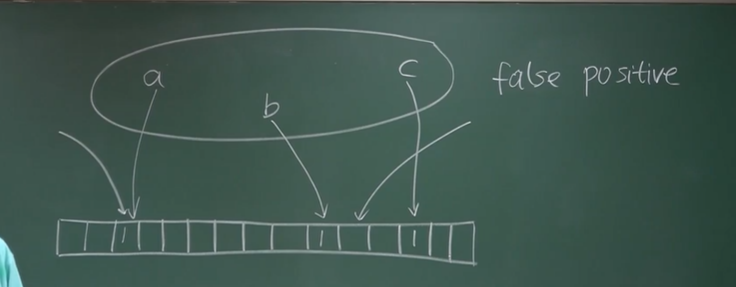

查询：先查询区块块头中的bloom filter 有目标交易类型，没有舍弃，有的话查询区块包含交易对应收据树中的bloom filter，快速过滤大量无关交易

ETH运行过程看做是交易驱动的状态机（transaction-dirven state machine , 通过交易驱动系统从当前状态转移到下一个状态，BTC也可以将UTXO看做是状态），**状态转移需要是确定性的**

一些问题：

- 以下说法是否可行：在每个区块中维护一个状态树，只保存当前区块用到的交易账户状态？

    A -> B 10 ETH，需要知道当前账户A B，的状态
    
    查找某个账户余额比较困难；如果转账账户是一个不存在的区块就需要一直追溯到Genesis创世区块

**交易树和收据树的创建过程**

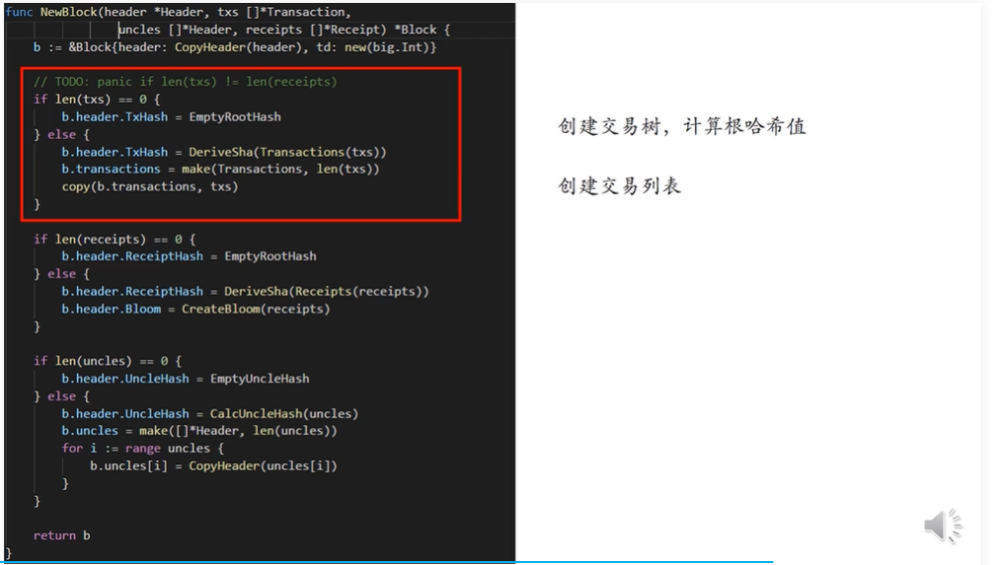

**DeriveSha 获取根hash**

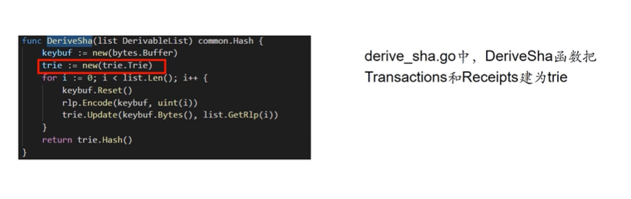

**Trie结构**

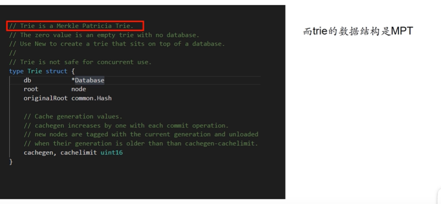

**receipt 结构**

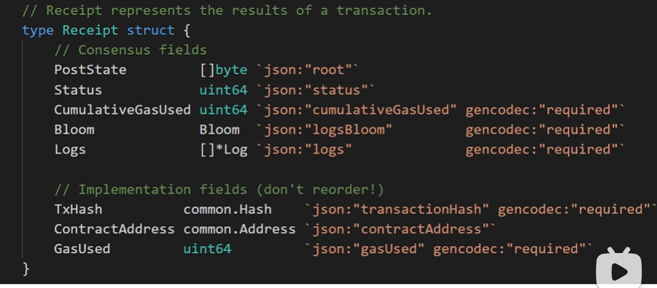

**区块头结构**

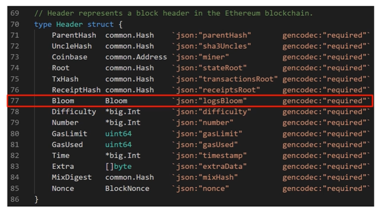

**create-bloom**

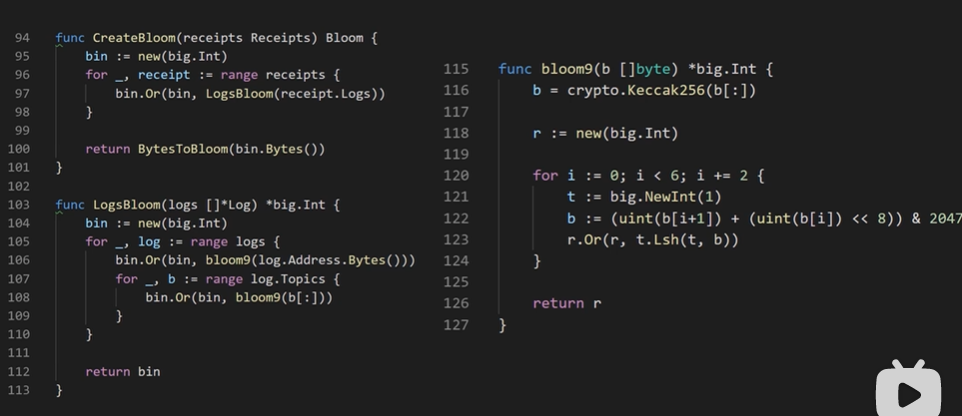

**query**

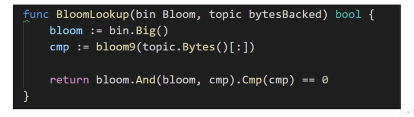

## ETH-Ghost协议

如果分叉很多，大型矿池(mining pool)会有  bias(中心化算力优势 mining centralization)

初始Ghost协议：没成为最长合法链的区块被称为uncle block，如果uncle之后被包含也可以获得大部分的出块奖励$\frac78\times 3$ ETH，对于包含uncle block的节点能额外获得$\frac1{32}\times 3$ ETH，且最多包含两个uncle block,有利于系统出现分叉后及时进行合并

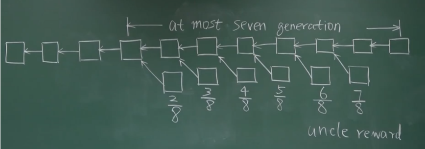

上述协议的问题：

- 超过两个uncle
- 在最长合法链上拓展时没有看到有uncle
- 自私的记账人处于商业竞争，故意不包含uncle

修改Ghost：最长合法链(防篡改，解决临时性分叉)上所有的区块都认之前的orphan block为uncle

- 为防止先产生很多uncle，之后一直包含前面的uncle，另加规定：当代uncle得到7/8，隔代uncle得到6/8，直到2/8，即uncle block和当前区块有7代以内的共同祖先，合法的uncle只有6个辈分，此为uncle reward；而包含uncle的block永远是1/32，鼓励出现分叉以后尽早进行合并

ETH的奖励分为block reward(static)和gas fee(dynamic)，但是uncle block是得不到后者

包含uncle block的时候不会执行uncle block的交易，只会检查uncle block的合法性（是否符合挖矿难度即是否得到了记账权）

- 交易可能会与主链上的冲突，或者变 为非法交易，因而不会检查交易的合法性

如果分叉链之后还跟着一串，不会对后面跟着的区块提供奖励，只有第一个uncle可以得到奖励，如果给后面的uncles提供的话，forking attack的成本就很低，因为不成功的forking attack还能得到奖励

## ETH-挖矿算法

blockchain is secured by mining

bug bounty

目标是ASIC resistance，所以设计了memory hard mining puzzle 

LiteCoin莱特币使用的mining puzzle为scrpyt，但是verify需要的内存区域和solve的区域大小相同，为了能在各种小型机器上挖矿，故设置内存大小仅为128K，由此导致没有ASIC resistance

- 弊端验证和求解都困难 (**difficult  to solve but easy to verify**)
- 因此实际使用时只有128k

ETH有两个数据集16M cache和1G dataset DAG，这两个数据集随时间增长而增大。

挖矿算法ethash：

有一个数组，对seed取hash放在第一个，然后对第一个取hash放在第二个，由此填满整个cache数组。

然后通过cache中的第`i % cache_size`个元素生成初始mix，然后循环256次，每次用`get_int_from_item`来得到下一个要访问的cache元素的下标，用这个cache元素和mix得到新的mix，最后对mix取hash放在dataset的第i个位置

```python
# 每隔30000个块会重新生成seed（对原来的seed取hash）
# cache初始大小为16M,每隔30000个区块重新生成时增大初始大小的1/128即128K
def mkcache(cache_size, seed):
    #第一个元素为种子的hash
    o = [hash(seed)]
    for i in range(1, cache_size):
        #后面的每个元素是前一个元素的hash
        o.append(hash(o[-1]))
    return o

# 从cache生成1G的大数据集
# 求dataset第i个元素
def calc_dataset_item(cache, i):
    cache_size = cache.size
    mix = hash(cache[i % cache_size] ^ i)
    for j in range(256):
        #求出下一个要读取的位置
        cache_index = get_int_from_item(mix)
        # 通过index位置的数和当前的hash计算出下一个hash值
        mix = make_item(mix, cache[cache_index % cache_size])
        #依次迭代256轮，获取64字节的hash,作为大数据集中的第i个元素
    return hash(mix)

# 求整个dataset
def calc_dataset(full_size, cache):
    return [calc_dataset_item(cache, i) for i in range(full_size)]

# dataset初始大小为1G,每隔30000个区块重新生成时增大初始大小的1/128即8M
# 矿工挖矿header(方便轻节点验证，nonce，大数据集的个数，生成的大数据集)
def hashimoto_full(header, nonce, full_size, dataset):
    mix = hash(header, nonce)
    for i in range(64):
        dataset_index = get_int_from_item(mix) % full_size
        mix = make_item(mix, dataset[dataset_index])
        mix = make_item(mix, dataset[dataset_index + 1])
    #用于与挖矿难度的目标阈值比较
    return hash(mix)
# 轻节点验证
def hashimoto_light(header, nonce, full_size, cache):
    mix = hash(header, nonce)
    for i in range(64):
        dataset_index = get_int_from_item(mix) % full_size
        
        mix = make_item(mix, calc_dataset_item(cache, dataset_index))
        mix = make_item(mix, calc_dataset_item(cache, dataset_index + 1))
    return hash(mix)

# mine function
def mine(full_size, dataset, header, target):
    nonce = random.randint(0, 2**64)
    while hashimoto_full(header, nonce, full_size, dataset) > target:
        nonce = (nonce + 1) % 2**64
    return nonce
```

目前主要是  GPU挖矿

目前仍然是PoW（Proof of Work），一直想转向PoS（Proof of Stake权益证明），这是不挖矿的

ETH使用pre-mining，预留了一些ETH（实际上是绝大部分）给创始人，pre-sale相当于众筹，买一些初始币作为后续开发的资金

- <->挖矿的算法设计要尽可能的让通用计算设备也能够参加，参加的人越多，挖矿的越民主，区块链就越安全
- <-> ASIC芯片  挖矿成本高，早期需要投入大量资源，攻击成本高
- 这玩意真就有好有坏吧

## ETH-挖矿难度的调整

BTC是每隔2016个区块调整一次，维持出块时间平均在10分钟左右。ETH是每个区块都有可能调整难度，且调整算法比较复杂且有多个版本
$$
D(H)=\left\{
\begin{array}{lcl}
D_0 & & \rm{if~ H_1=0} \\
max(D_0,P(H)_{H_d}+x\times\zeta_2)+\epsilon & & \rm{otherwise}
\end{array}
\right.\\
{\rm where}~D_0=131072\\
x=\lfloor\frac{P(H)_{H_d}}{2048}\rfloor\\
\zeta_2=max(y-\lfloor\frac{H_s-P(H)_{H_s}}{9}\rfloor,-99)\\
\epsilon=\lfloor2^{\lfloor H_i'\div100000\rfloor-2}\rfloor\\
H_i'=max(H_i-3000000,0)
$$
其中$P(H)_{H_d}+x\times\zeta_2)+\epsilon$是基础难度，$\epsilon$是难度炸弹为了向权益证明过渡

$P(H)_{H_d}$是父区块的难度

 $y$和父区块的uncle数有关，如果父区块中包含uncle，则$y=2$，否则$y=1$，因为包含uncle的时候新发行的货币量大，需要适当提高难度

$H_s$是本区块的时间戳，$P(H)_{H_s}$是父区块的时间戳，均以秒为单位，并规定$H_s>P(H)_{H_s}$，出块时间过短就提高难度，否则下降

所以如果父区块不包含uncle（$y=1$），则当出块时间小于等于8的时候就要提高难度，大于17的时候降低难度

设置难度炸弹的原因：当协议迁到PoS时提高矿工迁移的意愿

$\epsilon$是2的指数，每10万个块扩大一倍，增长速度快，以此提高挖矿难度使得矿工不得不放弃挖矿，转向PoS，但是目前PoS还没有成功实现，导致难度过高，于是修改了原来的协议，将出块号减少300W个，并把出块奖励从5个降为2个

## ETH-权益证明

**proof of state**

virtual mining 币的数量就是投票权(反正就是钱呗)

优点：

- 环保
- PoW没有实现闭环，发动攻击的资源可以从系统外部获取(比如花钱购买矿机提升算力)，小币种很容易受到外界大资本的攻击AltCoin Infanticide(扼杀在摇篮中)；而PoS中，发送攻击的资源必须从系统内部获取，实现了闭环，如果外界资源大量买入该币种，就会导致升值，反而使得其不易被攻击

有的币采用PoW和PoS的混合，即挖矿难度和你持有的币的数量相关，但是这样会有马太效应(富者越富，穷者越穷)，所以会有Proof of Deposit，你投入一些币来降低挖矿难度，然后这些投入的币在一定时间内不能再用

挑战：  

- 挖矿不能两边都挖，但下注可以两边都下
- 出现两边下注情况nothing at stake，即多分叉时，你在不同的分叉中投入币来决定哪个分叉是最长合法链，这些钱是不会被锁定的，就可以两边下注

ETH准备使用的权益证明方法叫Casper the Friendly Finality Gadget (FFG)

引入Validator验证者，投入一定ETH作为保证金被锁定，职责是推动达成哪条是最长合法链的共识，投票的权重取决于保证金的数目大小。每挖除100个区块就作为一个epoch，而epoch成为一个finality需要投票，第一轮投票是prepare message，第二轮投票是commit message，每一轮投票都需要有2/3的通过。实际实现时：不区分两个message，同时降低epoch为50个区块，要连续两个epoch都得到2/3的同意才通过。验证者验证通过也可以得到奖励，有不良行为就扣除部分保证金，两边下注全部销毁，验证者有任期和等待期，当等待期无人举报之后可以得到保证金和奖励

## ETH-智能合约

智能合约是运行在区块链上的一段代码，代码逻辑定义了合约的内容

智能合约账户保存了当前合约的状态

- balance 当前账户余额
- nonce 交易次数
- code 合约代码
- storage 存储，数据结构是一颗MPT

数组：push / length 				bidders.push(bidder) 			bidder.length

map hash table默认为0，不支持遍历，需要另外存储

### 调用智能合约

- 外部账户调用智能合约

    - 创建一个交易，接收地址为要调用的那个合约地址，data域填写要调用的函数及其参数的编码值

- 合约之间调用(一个交易只有EOA可以发起，合约不能主动调用)

    -  直接调用(调用合约执行错误，会导致发起调用的合约，回滚)

        ~~~solidity
        contract A {
        	event LogCallFoo(string str);
        	function foo(string str) returns (uint){
        		emit LogCallFoo(str);
        		return 123;
        	}
        }
        
        contract B {
        	uint ua;
        	function callAFooDirectly(address addr) public {
        		A a = new A(addr);
        		ua = a.foo("call foo directly");
        	}
        }
        
        ~~~

    -  使用address 类型的call函数

        ~~~solidity
        contract C {
        	function callAFooByCall(address addr)public returns (bool) {
        //1.第一个参数被编成4个字节，表示要调用的函数签名(funcName(paramType))
        	//2.其他参数会被扩展到32个字节，表示要调用的函数的参数
        	//3.call返回true，表示函数执行完毕，返回false表示引发EVM异常，无法获取函数返回值，发起调用的函数并不会抛出异常，而是继续执行
        		bytes4 funcsig = bytes4(keccak256("foo(string)"));
        		if (addr.call(funcsig,"call foo by func call"))
        			return true;
                return false
        	}
        }
        可以通过.gas() .value()调整提供的gas数量或者提供一些ETH
        ~~~

    -  delegatecall()

        -  使用与call相同，只是不能使用.value()
        -  不需要切换到被调用的合约的环境中执行，而是在当前合约的环境中执行，即context
            -  call切换到被调用的智能合约的上下文
            -  delegateCall()只是用给定地址的代码，其余属性(存储，余额等)都取自当前合约，delegateCall目的是使用存储在另外合约中的库代码

- payable 接受外部转账

- fallback()

    - ```solidity
        function() public [payable] {
        	...
        }
        //匿名函数，无参无返回值
        调用情况：
        	- 直接向一个合约地址转账而不加任何data
        	- 被调用的函数不存在
        若转账金额不为零，同样需要声明payable,否则会抛出异常
        转账金额可以为0，但是gas费是要给的
        ```

### solidity样例

#### V1

```solidity
// 声明使用的solidity版本
//SPDX-License-Identifier:MIT
pragma solidity ^0.4.21

面向对象的编程语言，强类型语言

contract SimpleAuction {
	// 状态变量
	address public beneficiary; // 拍卖受益人
	uint public auctionEnd; // 拍卖结束时间
	address public highestBidder; // 当前最高出价人
	mapping(address => uint) bids; // 所有竞拍者的出价
	address[] bidders; // 所有竞拍者
	bool ended; // 是否结束竞拍
	 
	// log记录
	// 需要记录的事件
	//拍卖的最高售价增加
	event HighestBidIncreased(address bidder, uint amount);
	event AuctionEnded(address winner,int amount);
    
	// 构造函数，仅在合约创建时调用一次
	// 以受益者地址`_beneficiary`的名义，
	// 创建一个简单的拍卖，拍卖时间为`_biddingTime`秒
	constructor(uint _biddingTime, address _beneficiary) public {
		beneficiary = _beneficiary;
		auctionEnd = now + _biddingTime;
	}
	
	// 成员函数，可以被一个外部账户或者合约账户调用
	// 对拍卖进行出价，随交易一起发送的ether与之前已经发送的ether的和为本次出价
	function bid() public payable {
		// 拍卖尚未结束
		require(now <= auctionEnd);
		
		// 如果出价不够高，本次出价无效，直接报错返回
		//msg.value 发起调用时转账的eth数目
		//上次的出价+当前调用的eth
		//查询键值不存在，返回默认值为0
		require(bids[msg.sender] + msg.value > bids[highestBidder]);
		
		// 如果此人之前未出价，则加入到竞拍者列表中
		if (!bids[msg.sender] == uint(0)) {
			bidders.push(msg.sender);
		}
		
		// 本次出价比当前最高者高，取代之
		highestBidder = msg.sender;
		bids[msg.sender] += msg.value;
		emit HighestBidIncreased(msg.sender, bids[msg.sender]);
	}
	
	// 结束拍卖，把最高的出价发送给受益人
	// 并把未中标的出价者的钱返还
	function auctionEnd() public {
		// 拍卖已截止
		require(now > auctionEnd);
		// 函数未被调用过
		require(!ended);
		
		// 把最高的出价发送给受益人
		beneficiary.transfer(bids[highestBidder]);
		for (uint i = 0; i < bidders.length; i++) {
			address bidder = bidders[i];
			if (bidder == highestBidder) continue;
			bidder.transfer(bids[bidder]);
			// 注意!!! 
			// 如果Hacker有个合约账户调用bid而它没有fallback函数，那么当退款的时候transfer发生问题，就会全部回滚，导致所有人都没有收到钱(solidity在执行过程中改的本地的状态，只有最后发布在Block Chain之后所有节点都照着做一遍)
		}
		ended = true;
        emit AuctionEnded(highestBidder, bids[highestBidder]);
	}
}

contract Hacker {
	function hack_bid(address addr){
		SimpleAuction sa = SimpleAuction(addr);
		sa.bid.value(msg.value())();
	}
}
```

#### V2

- 为了解决上述问题，提出：让投标者自己取回标价，将上述`auctionEnd`函数修改成两个小函数

```solidity
// 使用withdraw模式
// 由投标者自己取回出价，返回是否成功
function withdraw() public returns (bool) {
	// 拍卖已截止
	require(now > auctionEnd);
	// 竞拍成功者需要把钱给受益人，不可取回出价
	require(msg.sender != highestBidder);
	// 当前地址有钱可取
	require(bids[msg.sender] > 0);
	
	uint amount = bids[msg.sender];
	if (msg.sender.call.value(amount)()) {
		bids[msg.sender] = 0;
		return true;
	}
	return false;
}

event Pay2Beneficiary(address winner, uint amount);
// 结束拍卖，把最高的出价发送给受益人
function pay2Beneficiary() public returns (bool) {
	// 拍卖已截止
	require(now > auctionEnd);
	// 当前地址有钱可取
	require(bids[highestBidder] > 0);
	
	uint amount = bids[highestBidder];
	bids[highestBidder] = 0; // 注意这里先置为0然后再withdraw
	emit Pay2Beneficiary(highestBidder, bids[highestBidder]);
	
	if (!beneficiary.call.value(amount)()) {
		bids[highestBidder] = amount;
		return false;
	}
	return true;
}
```

但是还可以发动重入攻击 (Re-entrancy Attack)：

```solidity
contract HackV2 {
	uint stack = 0;
	function hack_id(address addr) payable public{
		SimpleAuction sa = SimpleAuction(addr);
		sa.bid.value(msg.value)();
	}
	
	function hack_withdraw(address addr) public payable{
		SimpleAuction(addr).whthdirw();
	}
	
	function() public payable {
        stack += 2;
        if (msg.sender.balance >= msg.value && msg.gas > 6000 && stack < 500) {
            SimpleAuctionV2(msg.sender).withdraw();
        }
	}
}
```

当contract的`withdraw`执行到`msg.sender.call.value(amount)()`时，就会触发上面的fallback函数，此时又会调用`withdraw`，陷入递归。

但是上面的写法没有问题，因为已经先把对应账户余额设置成0了

最好将call改成send或者transfer，因为gas fee比较少

---

### 智能合约的创建和运行

- 智能合约的代码写完后，要编译成bytecode

- 创建合约：外部帐户发起一个转账交易到0x0的地址

    - 转账的金额是0，但是要支付汽油费

    - 合约的代码放在data域里

    - 矿工打包，返回合约地址

- 智能合约运行在EVM (Ethereum Virtual Machine)上
    - 256位寻址 
    - 通过加一层虚拟机，对智能合约的运行提供一致性平台  world wide computer
- 以太坊是一个交易驱动的状态机
    - 调用智能合约的交易发布到区块链上后，每个矿工都会执行这个交易，从当前状态确定性地转移到下一个状态
- 挖矿和智能合约的执行先后顺序？
    - 注意Block Header中有三棵树的根hash值，而试nonce的时候需要固定Block Header
    - 所以必须先执行得到Block Header
    - 如果我在本次消耗资源执行智能合约但是最后没有记账权，我能得到啥？
        - Gas Fee是没有的，只给最后得到记账权的人
        - uncle reward也是没有必要的，因为无记忆性，比如直接切换到最长合法链上挖
        - 实际上没有补偿，而且得自己本地都验证一遍，假如我不验证（后果是影响安全性），三棵树的内容没有更新，就得不到正确的根hash值
- 如果智能合约出错也要发布到区块链上，因为也要有Gas Fee
- 智能合约支不支持多核并行处理？不支持，因为状态机必须是完全确定，同时也不能产生真随机数

### Gas Fee

- 智能合约是个Turing-complete Programming Model 图灵完备的编程语言啊，这个玩意真的是

    - 出现死循环怎么办？因为有Gas Limit，所以即使是Halting Problem(停机问题)也没关系

- 执行合约中的指令要收取汽油费，由发起交易的人来支付

    ```go
    type txdata struct {
    	AccountNonce uint64  `json : "nonce"   gencodec : "required"`
        Price 		 *bigInt `json: "gasPrice" gencodec : "required"`
        GasLimit     uint64  `json: "gas"      gencodec : "required"`
    	Recipient    *commonAddress `json:"to" rlp: "nil"` // nil means contract    creation 收款人地址
        Amount       *bigInt `json: "value"    gencodec : "required"`//转账金额
    	Payload      []byte  `json: "input"    gencodec : "required"`//data域
    }
    ```

- EVM中不同指令消耗的汽油费是不一样的

- 简单的指令很便宜，复杂的或者需要存储状态的指令就很贵

### 错误处理

- 执行具有原子性，完全执行或者完全不执行

- 如果GasFee不够的话就会回滚交易，但Gas也不会退回，防止DDos攻击；剩下的会退回

- 智能合约中不存在自定义的try-catch结构

- 一旦遇到异常，除特殊情况外，本次执行操作全部回滚

- 可以抛出错误的语句:

    - assert(bool condition):如果条件不满足就抛出—用于内部错误。 

    - require(bool condition):如果条件不满足就抛掉—用于输入或者外部组件引起的错误。

    - ```solidity
        function bid() public payable {
        	//对于能接收以太币的函数，关键字payable是必须的。
        	// 拍卖尚未结束
        	require( now <= auctionEnd) ;
        }
        ```
    
- revert():终止运行并回滚状态变动。 

### 嵌套调用

- 智能合约的执行具有原子性:执行过程中出现错误，会导致回滚
- 嵌套调用是指一个合约调用另一个合约中的函数
- 嵌套调用是否会触发连锁式的回滚?
    - 如果被调用的合约执行过程中发生异常，会不会导致发起调用的这个合约也跟着一起回滚?
    - 有些调用方法会引起连锁式的回滚，有些则不会
- 一个合约直接向一个合约帐户里转账,没有指明调用哪个函数,仍然会引起嵌套调用，比如调用fallback函数

### Block Header与Gas有关的部分

- Gas Limit
    - BTC可以用1M大小来约束资源使用，而ETH使用Gas Limit来约束资源使用，这个Limit可以由矿工微调，可以上下调整$\frac1{1024}$
- Gas Used

### Receipt数据结构

- 三棵树维护在全节点本地，记录账户状态，只有合约执行完，发布在区块上之后，本地修改才可变成外部可见的，才可以变成共识
- 先挖矿 or  先执行合约 ？
    - 先执行合约，获得三棵树的根hash，再尝试nonce 
    - 执行合约，但没挖到区块
        - 补偿呢？没有，不仅如此，还得把别人发布的区块上的交易执行一遍。
- gas fee 收取？->   从本地账户余额中减掉
- 执行错误的合约也要发布到区块上，扣gas fee 
- 每个交易执行完形成收据树，status 表示执行情况
- 智能合约是否支持多核并行处理？多线程
    - 不支持，Etthereum是交易驱动的状态机，面对同一组输入，产生的输出必须/转移到的下一个状态必须确定，(因为所有全节点必须执行验证)
    - 多线程？多个核对内存访问顺序不同，执行结果有可能不确定

```go
// Receipt represents the results of a transaction.
type Receipt struct {
	// consensus fields
    Poststate 		  []byte `json : "root"` 
	Status 			  uint64 `json : "status"`
	CumulativeGasUsed uint64 `json: " cumulativeGasUsed" gencodec : "required"`
	Bloom 			  Bloom  `json : "logsBloom"         gencodec : "required"`
	Logs			  []*Log `json: "logs"               gencodec : "required"`
	
	// Implementation fields (don't reorder ! )
	TxHash 			  common.Hash     `json : "transactionHash" gencodec : "required"`
	ContractAddress   common.Address `json : "contractAddress"`
	Gasused           uint64          `json : "gasused"         gencodec : "required"`
}
```

`Status`表示执行状态

### 智能合约可以获得的区块信息

智能合约不能像通用的编程语言一样通过系统调用获取环境信息，每个全节点执行环境不同，只能通过固定的一些变量值获取区块链状态信息

- `block.blockhash(uint blockNumber) returns (bytes32)`:给定区块的哈希-仅对最近的256个区块有效而不包括当前区块
- `block.coinbase (address)`:挖出当前区块的矿工地址
- `block.difficulty (uint)`:当前区块难度
- `block.gaslimit (uint)`:当前区块gas限额
- `block.number(uint)`:当前区块号
- `block.timestamp (uint)`:自unix epoch 起始当前区块以秒计的时间戳

### 智能合约可以获得的调用信息

- `msg.data(bytes)`:完整的calldata
- `msg.gas(uint)`:剩余gas
- `msg.sender(address)`:消息发送者（当前调用)
- `msg.sig(bytes4)`: calldata的前4字节（也就是函数标识符)
- `msg.value(uint)`:随消息发送的wei的数量
- `now(uint)`:目前区块时间戳( block.timestamp )
- `tx.gasprice(uint)`:交易的gas价格
- `tx.origin(address)`:交易发起者（完全的调用链)

注意：消息发送者和交易发起者不一定相同，前者是当前合约调用方（局部），而后者是整个调用链最初的发起者

### 地址类型

#### 成员变量：

`<address>.balance(uint256)`:以Wei为单位的地址类型的余额。

#### 成员函数：

注意下面的address都是**转入地址/被调用地址**

`<address>.transfer(uint256 amount)`:当前合约账户向**地址类型（转入地址）**发送数量为amount的Wei，失败时抛出异常，发送2300gas的矿工费，不可调节。**会产生连锁回滚**。gas fee比较少，基本只能写个log

`<address>.send(uint256 amount) returns (bool)`:向地址类型发送数量为amount的 wei，失败时返回false，发送2300gas 的矿工费用，不可调节。**不会产生连锁回滚**，gas fee比较少，基本只能写个log

`<address>.call(...) returns (boo1)`:发出底层`CALL`，失败时返回false，发送所有可用gas，不可调节。

- `<address>.call.value(uint256 amount) returns (bool)()`，**不会产生连锁回滚**，发送所有可用gas，可用做更多的事情

`<address>.callcode(...) returns (boo1) `:发出底层`CALLCODE`，失败时返回false，发送所有可用gas，不可调节。

`<address>.delegatecall(...) returns (boo1)`:发出底层`DELEGATECALL`，失败时返回false，发送所有可用gas，不可调节。

所有智能合约均可显式地转换成地址类型

## ETH-TheDAO

DAO：Decentralized Autonomous Organization 

TheDAO，2016年5月出现的一个投资自治组织，将ETH换取TheDAO的代币，作为投资的投票权，也是最后划分受益的比例

收取收益是使用splitDAO方法，拆分The DAO可以成立childDAO，成立之后有28天锁定期  

Hacker利用重录攻击。ETH团队决定回滚，原则是只回滚与该交易有关的内容

第一步：修改协议，和TheDAO有关的账户不能进行交易——软分叉，但是出现了BUG，与这些账户进行交易应该是非法交易，但是gas fee还是要收的，以放DDos攻击，但是修改的时候出现BUG，这类交易没有收gas fee，最后矿工回滚版本，这个方案就失败了

第二步：与TheDAO相关的账户强行转到新账户上去，而不需要签名等——硬分叉

ETH分裂成ETH和ETC (Ethereum Classic)，给这两条链加上chainID

## ETH-反思

- 智能合约是否真的智能？

    实际上是自动合约，类似于ATM机

- 不可篡改性是双刃剑 

    - 软件升级,冻结账户，无法停止对智能合约的调用

- 没有什么是不可篡改的

    - 代码是死的，人是活的
    - 重大事件想改还是能改的

- solidity存在问题，可以尝试采用函数式语言、Formal Verification、**模板**、专门的智能合约机构。有些人认为语言表达能力要适中，但很难预料到之后的攻击和漏洞等。

    - 智能合约的历史的还是短，希望逐渐走向成熟

- 合约代码开源提高共性力和安全，但是还是存在漏洞，称为many eyeball fallacy，要小心仔细

- 硬分叉的过程是否只是核心团队的决策？并不是，而是广大矿工用脚投票的结果，分叉是民主的体现

- 去中心化不等于分布式系统，前者一定是分布的，但后者不一定是去中心化的。后者是用多个机器来提高运行效率，前者是为了容错（状态机模式，机器数目越多越慢）

## ETH-美链 

Beauty Chain是在部署在以太坊上的智能合约，有自己的代币BEC   

ICO：Inital Coin Offering

IPO：Initial Public Offering

ERC 20（Ethereum Request for Comments）是以太坊发布代币的标准

`uint256 amount = uint  256(cnt) * _value`出现问题（`cnt`表示接受转账的账户个数），如果`_value`很大，就会导致溢出使得`amount`变得很小，故当前账户只扣一点点钱，而其他账户会受到一大笔钱

solidity有专门的数学库`SafeMath`库，会自动检测是否溢出 

## 课程总结

中心化和去中心化不是泾渭分明的，一个系统可以有中心化成分也可以有去中心化成分。

加密货币应该用在传统货币不能很好解决的场景，例如跨境转账

加密货币并非与传统支付竞争，考虑特定的历史条件、各方面的因素

程序化是一个大趋势，软件将会改变世界

去中心化，智能合约不能解决所有问题，民主不一定是好事情，民主不一定是更完美的制度，具体问题具体分析
