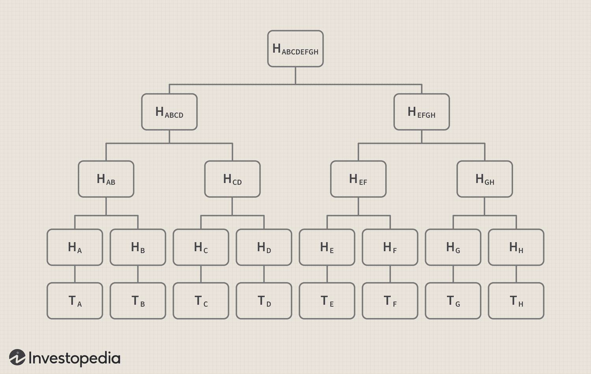
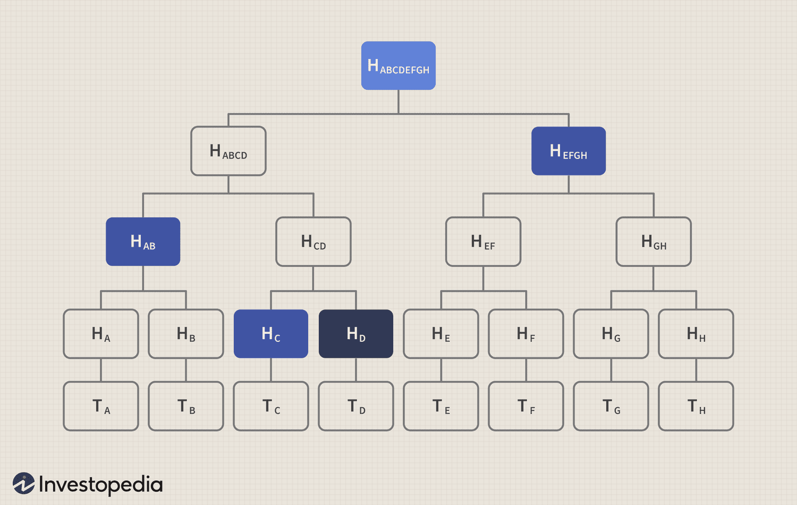
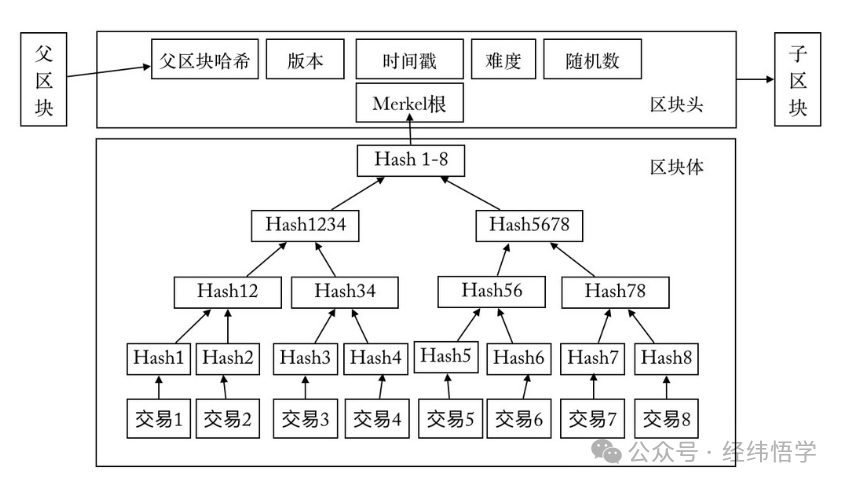
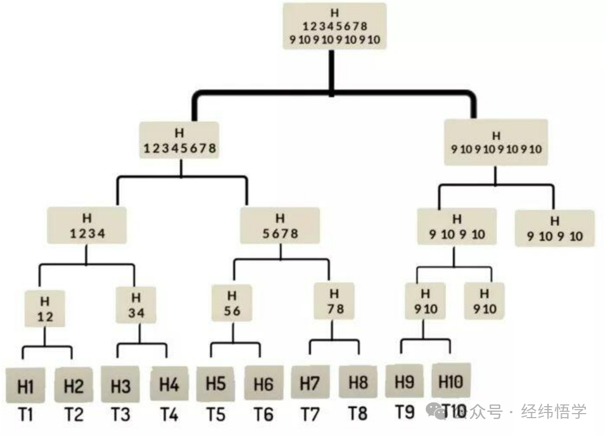
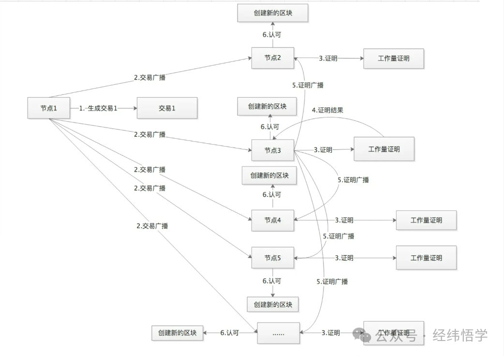

# 比特币白皮书学习

在听过大锤老师的课程和阅读比特币的白皮书之后。了解到比特币的发展历史。同时也了解了电子货币的发展历史。

1、传统的货币：传统的货币一般来说是政府机构，中央银行的货币发行和结算。

2、电子货币：在20世纪80年代末，许多研究人员开始尝试使用密码学技术构建数字货币。这些早期的数字货币项目发行的数字货币，通常由国家法定货币或贵金属（如黄金）来背书。

3、比特币：Bitcoin是在2008年由署名Satoshi Nakamoto的牛人发明的，他出版了一篇题为“Bitcoin：A Peer-to-Peer Electronic Cash System”的文章[1]。 Nakamoto结合了诸如b-money和HashCash等先前的发明，创建了一个完全去中心化的电子现金系统，它不依赖中央机构进行货币发行、结算和验证交易。关键的创新是使用分布式计算系统（称为“工作量证明”算法），每10分钟进行一次全球性的“选举”，从而实现分布式网络达成全网交易状态的共识。

在整个电子货币发展的过程中，始终面临着一个问题。即，双重支付的问题。传统货币，通常都是政府机构印刷的纸币。纸币天然的就可以避免双重支付的问题。因为同一张纸币不可能同时出现在两个地方，况且纸币由政府机构发行，政府必然拥有流通的货币的全局信息，那么只要经过精算所有的电子交易即可处理假币和避免双重支付。对于不能利用秘制油墨技术或全息条码的数字货币，密码学为保障用户财产价值的合法性提供了依据。比特币的诞生。从根本上解决了中央银行的货币发行和结算功能，取代了任何中央银行的功能。

比特币的四大创新
1、去中心化的点对点对等网络（比特币协议）
2、公开交易总帐（区块链）
3、独立验证交易和发行货币的一套规则（共识规则）
4、通过区块链有效实现全球去中心化共识的机制（工作量证明算法）

**UTXO**

比特币全节点跟踪所有可找到的和可使用的输出，称为 “未花费的交易输出”（unspent transaction outputs），即UTXO。

当用户的钱包已经“收到”比特币时，就意味着，钱包已经检测到了可用的UTXO，这些UTXO可以用钱包所控制的其中一个密钥消费。 因此，用户的比特币“余额”是指用户钱包中可用的UTXO总和，这些UTXO分散在几百个交易和几百个区块中。用户的 “比特币余额”，这个概念是比特币钱包应用创建的。比特币钱包扫描区块链，得到可以用这个钱包控制的密钥进行消费的所有UTXO，加到一起就计算出了该用户的余额 。大多数钱包维护一个数据库或使用数据库服务来存储所有UTXO的快速引用集，其中包含可以使用用户的密钥进行消费的所有UTXO。
一个UTXO可以是1“聪”（satoshi）的任意倍数（整数倍）。就像美元可以被分割成表示两位小数的“分”一样，比特币可以被分割成八位小数的“聪”。尽管UTXO可以是任意值，但一旦被创造出来，即不可分割。这是UTXO值得被强调的一个重要特性：UTXO的面值为“聪”的整数倍，是离散（不连续）且不可分割的价值单位，一个UTXO只能在一次交易中作为一个整体被消耗。

**数据结构 默克尔树**

What Is a Merkle Tree?
A Merkle tree is a data structure that is used in computer science applications. In bitcoin and other cryptocurrencies​, Merkle trees serve to encode blockchain data more efficiently and securely.

They are also referred to as "binary hash trees."

Breaking Down Merkle Tree
In bitcoin's blockchain​, a block of transactions is run through an algorithm to generate a hash, which is a string of numbers and letters that can be used to verify that a given set of data is the same as the original set of transactions, but not to obtain the original set of transactions. Bitcoin's software does not run the entire block of transaction data—representing 10 minutes' worth of transactions on average—through the hash function at one time, however.
1
Rather, each transaction is hashed, then each pair of transactions is concatenated and hashed together, and so on until there is one hash for the entire block. (If there is an odd number of transactions, one transaction is doubled and its hash is concatenated with itself.)

Visualized, this structure resembles a tree. In the diagram below, "T" designates a transaction, "H" a hash. Note that the image is highly simplified; an average block contains over 500 transactions, not eight.

2
The hashes on the bottom row are referred to as "leaves," the intermediate hashes as "branches," and the hash at the top as the "root." The Merkle root of a given block is stored in the header: for example, the Merkle root of block #482819 is e045b18e7a3d708d686717b4f44db2099aabcad9bebf968de5f7271b458f71c8. The root is combined with other information (the software version, the previous block's hash, the timestamp, the difficulty target, and the nonce) and then run through a hash function to produce the block's unique hash: 000000000000000000bfc767ef8bf28c42cbd4bdbafd9aa1b5c3c33c2b089594 in the case of block #482819. This hash is not actually included in the relevant block, but the next one; it is distinct from the Merkle root.

3

The Merkle tree is useful because it allows users to verify a specific transaction without downloading the whole blockchain (over 350 gigabytes at the end of June 2021).
4
 For example, say that you wanted to verify that transaction TD is included in the block in the diagram above. If you have the root hash (HABCDEFGH), the process is like a game of sudoku: you query the network about HD, and it returns HC, HAB, and HEFGH. The Merkle tree allows you to verify that everything is accounted for with three hashes: given HAB, HC, HEFGH, and the root HABCDEFGH, HD (the only missing hash) has to be present in the data.

Merkle trees are named after Ralph Merkle, who proposed them in a 1987 paper titled "A Digital Signature Based on a Conventional Encryption Function." Merkle also invented cryptographic hashing.

**POW 工作量证明**

PoW(Proof of Work)，即工作量证明，闻名于比特币，俗称"挖矿”。PoW是指系统为达到某一目标而设置的度量方法。简单理解就是一份证明，用来确认你做过一定量的工作。监测工作的整个过程通常是极为低效的，而通过对工作的结果进行认证来证明完成了相应的工作量，则是一种非常高效的方式。PoW是按劳分配，算力决定一起，谁的算力多谁记账的概率就越大，可理解为力量型比较。以下内容基于比特币的PoW机制。

工作量证明（PoW）通过计算一个数值( nonce )，使得拼揍上交易数据后内容的Hash值满足规定的上限。在节点成功找到满足的Hash值之后，会马上对全网进行广播打包区块，网络的节点收到广播打包区块，会立刻对其进行验证。

如何才能创建一个新区块呢？通过解决一个问题：即找到一个nonce值，使得新区块头的哈希值小于某个指定的值，即区块头结构中的“难度目标”。

如果验证通过，则表明已经有节点成功解迷，自己就不再竞争当前区块打包，而是选择接受这个区块，记录到自己的账本中，然后进行下一个区块的竞争猜谜。网络中只有最快解谜的区块，才会添加的账本中，其他的节点进行复制，这样就保证了整个账本的唯一性。作弊的话是不是更节省成本？对不起其他节点验证不通过打包的区块会被其他节点丢弃，就无法记录到总账本中，作弊的节点耗费的成本就白费了，因此在巨大的挖矿成本下，也使得矿工自觉自愿的遵守比特币系统的共识协议，也就确保了整个系统的安全。

在了解pow共识机制前，我们先了解下比特币区块的结构，下图是比特币区块的结构图：

从图上可知，比特币的结构分为区块头和区块体，其中区块头细分为：

父区块头哈希值：前一区块的哈希值，使用SHA256(SHA256(父区块头))计算。占32字节

随机数(Nonce)：为了找到满足难度目标所设定的随机数，为了解决32位随机数在算力飞升的情况下不够用的问题，规定时间戳和coinbase交易信息均可更改，以此扩展nonce的位数。占4字节

版本：区块版本号，表示本区块遵守的验证规则。占4字节

时间戳：该区块产生的近似时间，精确到秒的UNIX时间戳，必须严格大于前11个区块时间的中值，同时全节点也会拒绝那些超出自己2个小时时间戳的区块。占4字节

难度：该区块工作量证明算法的难度目标，使用特定算法编码。占4字节

Merkle根：该区块中交易的Merkle树根的哈希值，同样采用SHA256(SHA256())计算。占32字节

我们会发现，区块头总共占了80字节。

区块体除了筹币交易记录（由一棵Merkle二叉树组成)外，还有一个交易计数。

比特币的任何一个节点，想生成一个新的区块，必须使用自己节点拥有的算力解算出pow问题。因此，我们先了解下pow工作量证明的三要素。

二、POW工作量证明的三要素

工作机制

为了使区块链交易数据记录在区块链上并在一定时间内达到一致（共识），PoW提供了一种思路，即所有区块链的网络节点参与者进行竞争记账，所谓竞争记账是指，如果想生成一个新的区块并写入区块链，必须解出比特币网络出的工作量证明谜题，谁先解出答案，谁就获得记账权利，然后开始记账并将将解出的答案和交易记录广播给其他节点进行验证，自己则开始下一轮挖矿。如果区块的交易被其他节点参与者验证有效并且谜题的答案正确，就意味着这个答案是可信的，新的节点将被写入验证者的节点区块链，同时验证者进入下一轮的竞争挖矿。

这道题关键的三个要素是工作量证明函数、区块及难度值。工作量证明函数是这道题的计算方法，区块决定了这道题的输入数据，难度值决定了这道题的所需要的计算量。

1、工作量证明函数

在比特币中使用的是SHA256算法函数，是密码哈希函数家族中输出值为256位的哈希算法。

2、 区块

区块头在前言中已经做详细介绍，这里就介绍下区块体的 Merkle树算法：

3、难度值，直接看公式：

新难度值=旧难度值*（过去2016个区块花费时长/20160分钟）

tips：难度值是随网络变动的，目的是为了在不同的网络环境下，确保每10分钟能生成一个块。

新难度值解析：撇开旧难度值，按比特币理想情况每10分钟出块的速度，过去2016个块的总花费接近20160分钟，这个值永远趋近于1。

目标值=最大目标值/难度值

目标值解析：最大目标值为一个固定数，若过去2016个区块花费时长少于20160分，那么这个系数会小，目标值将会被调大些，反之，目标值会被调小，因此，比特币的难度和出块速度将成反比例适当调整出块速度。

那如何计算呢？SHA256(SHA256(Block_Header))，即只需要对区块头进行两次SHA256运算即可，得到的值和目标值进行比较，小于目标值即可。

区块头中有一个重要的东西叫MerkleRoot的hash值。这个值意义在于：为了使区块头能体现区块所包含的所有交易，在区块的构造过程中，需要将该区块要包含的交易列表，通过Merkle Tree算法生成Merkle Root Hash，并以此作为交易列表的摘要存到区块头中。至此，我们发现区块头中除过nonce以外，其余的数据都是明确的，解题的核心就在于不停的调整nonce的值，对区块头进行双重SHA256运算。

介绍完pow工作量证明的三要素后，我们可以讲解下工作量证明的流程。

三、POW工作量证明流程

从流程图中看出，pow工作量证明的流程主要经历三步：

1.生成Merkle根哈希

       生成Merkle根哈希在第二章节中的第2要素中已经有讲解，即节点自己生成一笔筹币交易，并且与其他所有即将打包的交易通过Merkle树算法生成Merkle根哈希，所以为什么说区块是工作量证明的三要素之一。

2.组装区块头

    区块头将被作为计算出工作量证明输出的一个输入参数，因此第一步计算出来的Merkle根哈希和区块头的其他组成部分组装成区块头，这也就是为什么我们在前言中大费周章的去提前讲解比特币的区块头。

3.计算出工作量证明的输出，直接通过公式和一些伪代码去理解工作量证明的输出：

 i. 工作量证明的输出=SHA256(SHA256(区块头))

 ii. if（工作量证明的输出<目标值），证明工作量完成

 iii.if（工作量证明的输出>=目标值）,变更随机数，递归i的逻辑，继续与目标值比对。

注：目标值的计算见第二章节的要素3的难度值。

四.pow共识记账

        第三章中讲解的是单节点工作量证明流程，有了这个计算流程，我们就得将其使用起来，在比特币平台中，中本聪就是运用的pow工作量证明来使全网节点达到51%及以上的共识记账，以下将介绍pow工作量证明共识是如何记账的？

首先，客户端产生新的交易，向全网广播

第二，每个节点收到请求，将交易纳入区块中

第三，每个节点通过第三章中描述的pow工作量证明

第四，当某个节点找到了证明，向全网广播

第五，当且仅当该区块的交易是有效的且在之前中未存在的，其他节点才认同该区块的有效性

第六，接受该区块且在该区块的末尾制造新的区块

大概时序图如下：

五、POW的优缺点

优点：

安全性高： PoW 算法基于工作量证明，要篡改区块链上的数据需要控制网络中大多数的算力，这是非常困难的，因此提供了高度的安全性。
去中心化： PoW允许任何人都可以参与挖矿，而不需要中心化的控制机构。这样确保了网络的去中心化性质。
广泛应用： PoW 被广泛应用于比特币等主流区块链，具有成熟的技术和广泛的社区支持。
抗攻击性强： PoW 机制使得网络对于各种攻击，如51%攻击，拒绝服务攻击等具有较强的抵抗力。
交易频率低：每秒钟最多只能做七笔交易，效率低下。
缺点：

能源消耗大： PoW 需要大量的计算能力来解决数学问题，这导致了极高的能源消耗，对环境造成了一定的压力。
中心化倾向： 随着比特币挖矿的专业化和大规模农场的兴起，算力逐渐集中在少数大型矿池，导致了一定的中心化趋势。
效率低： PoW 机制需要大量的计算时间和资源，这使得交易确认的速度相对较慢，尤其是在高负载时。
不适应轻量级设备： PoW 对计算能力的要求高，这使得一些轻量级设备或者移动设备不太适合进行挖矿操作。
长期潜在威胁： 量子计算机等新兴技术的发展可能对 PoW 的安全性产生威胁，因为它们可能会在短时间内破解目前的加密算法。
虽然 PoW 在比特币等一些主流区块链上取得了成功，但是由于其能源消耗大、中心化倾向等问题，一些新兴的共识机制如Proof of Stake (PoS) 和Delegated Proof of Stake (DPoS) 等也开始得到广泛关注。这些机制旨在解决 PoW 的一些缺点，提高区块链的效率和可持续性。
