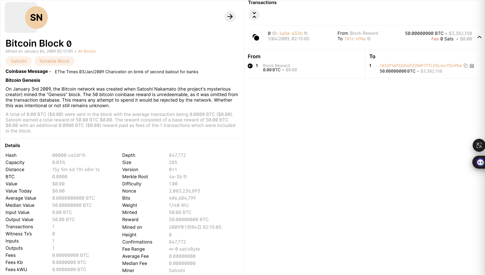
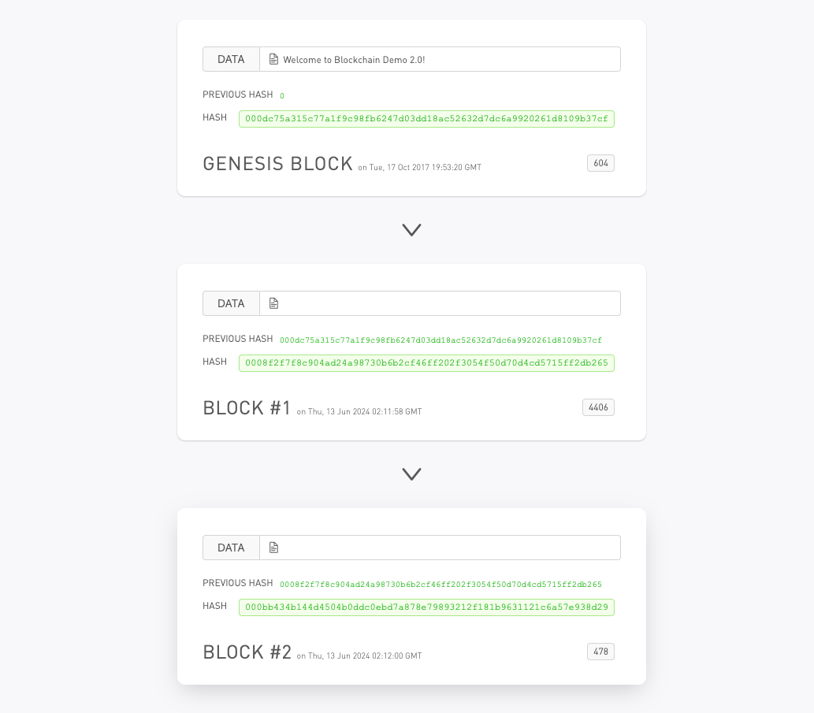

# 比特币的认识

## 比特币的诞生
2008年，一个名字叫Satoshi Nakamoto的人，在一个加密技术邮件列表发布比特币白皮书：“比特币：一种点对点的电子现金系统（Bitcoin: A Peer-to-Peer Electronic Cash System）”。
2009年1月3号，比特币的首个区块诞生，并在首个区块中记录了当天泰晤士报的头版标题：“The Times 03/Jan/2009 Chancellor on brink of second bailout for banks（财政大臣考虑再次紧急援助银行危机）”

## 比特币的重要概念

### 哈希算法
在比特币系统中，哈希算法绝对是一个非常重要的一个核心，使用也是比较多的，所以一定有必要了解哈希算法。
**哈希算法**，又称散列算法，它是一个**单向函数**，可以把**任意长度**的输入数据转化为**固定长度**的输出。
在比特币系统中，交易会用哈希，区块会用哈希，工作量证明会用哈希算法。

### 区块的结构体和链式结构
比特币中区块的结构如下：

主要分为**区块头**和**区块体**。区块头中包含了当前区块的一些特征，主要包含当前区块的哈希值，前一个区块的哈希值，区块的生成时间，区块的难度，区块的nonce值，区块体中包含了交易信息；区块体中包含的交易信息，交易信息中包含交易发起方，交易接收方，交易金额，交易时间，交易签名。

区块链是由一个一个区块构成的有序链表，每一个区块都记录了一系列交易，并且，每个区块都指向前一个区块，从而形成一个链条：结构如下

可以参考[blockchaindemo](https://blockchaindemo.io/)，真实比特币可以参考[blockchain.com](https://www.blockchain.com/explorer/assets/btc)

### UTXO模型
比特币是一个公开的账本，记账方式并不是使用传统的账户模式，我们观察任何一个交易，它总是由若干个输入（Input）和若干个输出（Output）构成，一个Input指向的是前面区块的某个Output，只有Coinbase交易（矿工奖励的铸币交易）没有输入，只有凭空输出。所以，任何交易，总是可以由Input溯源到Coinbase交易。还没有被下一个交易花费的Output被称为UTXO：Unspent TX Output，即未花费交易输出。比特币的交易模型和我们平时使用的银行账号有所不同，它并没有账户这个说法，只有UTXO。想要确定某个人拥有的比特币，并无法通过某个账户查到，必须知道此人控制的所有UTXO金额之和。

### POW 工作量证明
工作量证明也用到了哈希算法，区块的结构中有一个difficulty值和nonce值，nonce值是随机的， difficulty值是固定的， 区块上信息和nonce值一起可以计算出一个哈希值，我们通过判断这个哈希值开头0的个数和difficulty值是否相等，如果相等，则证明工作量证明成功，否则继续改变nonce值，直到成功。这个过程我们会贡献计算能力和电力等资源，就像矿工付出时间体力一样，所以这个过程也叫挖矿。

