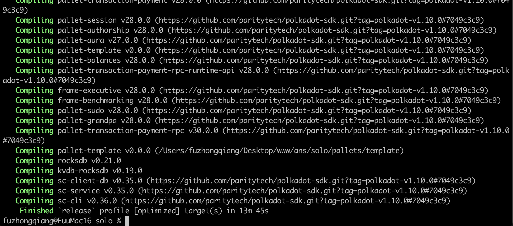
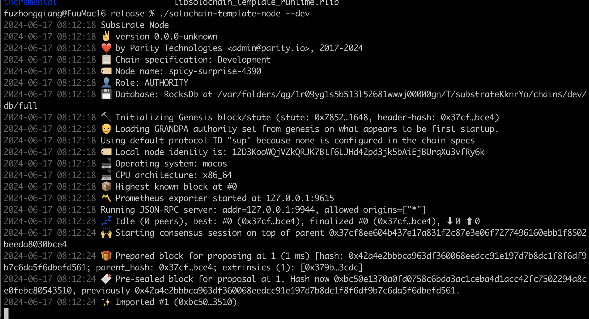
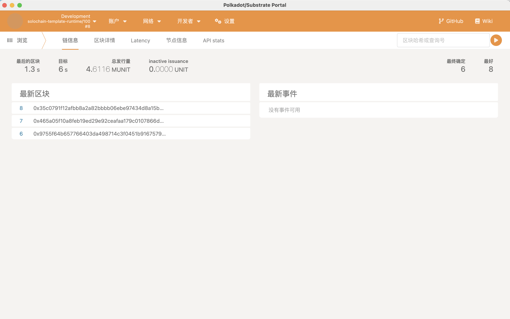
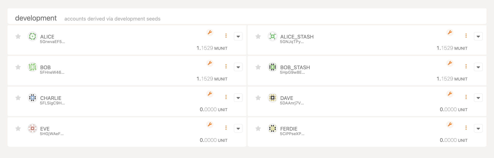
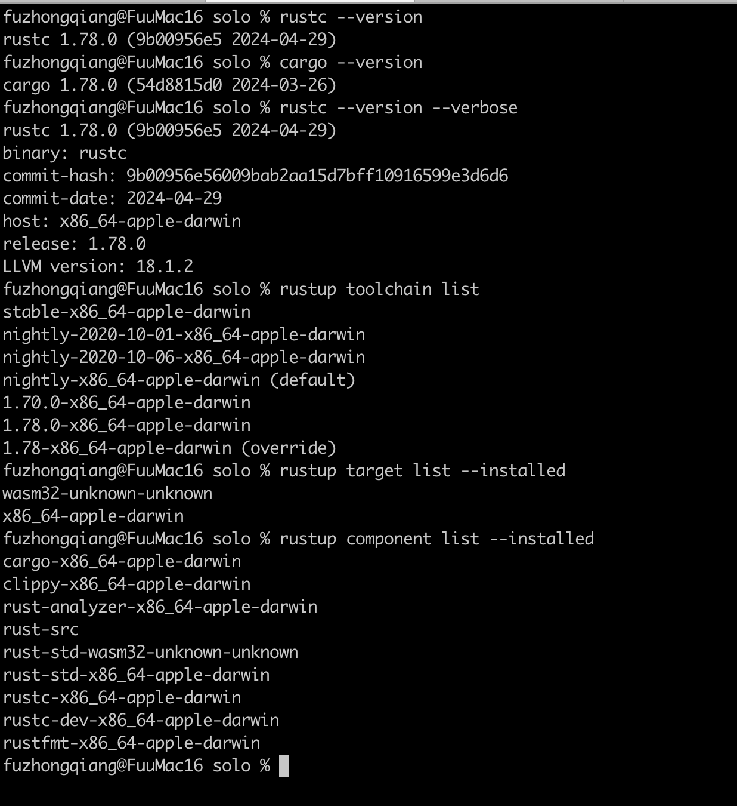

# Substrate节点运行作业

## Substrate的运行

### 后台的运行

- 编译的结果
    

- 运行的结果
    

### 前台的使用

- 出块的查看
    

- 账户情况查看
    

## 运行环境

- MacOS Sonoma (14.5)
    

- Rust 环境
    
    

## 遇到的问题

### 梯子不好使

- 会出现两种被墙的情况，一个是"Updating crates.io index"时候卡住，一个是"git repository `https://github.com/paritytech/polkadot-sdk.git`"时候卡住，都很蛋疼。

- 解决方法，一是部署一台海外的云服务器来编译substrate，二是换好用的梯子

- Github的代理修改（网页能打开，但是命令行没法正常运行Git的处理）

    ```Bash
        git config --global http.proxy 'http://127.0.0.1:1087'
        git config --global https.proxy 'http://127.0.0.1:1087'
        git config --global http.proxy 'socks5://127.0.0.1:1080'
        git config --global https.proxy 'socks5://127.0.0.1:1080'
    ```

### Rust的源修改

- 手动修改的方式，在 `~/.cargo` 目录下，修改config文件（如果没有的话，创建一个），添加以下内容，就能使用国内的源，会快不少

    ```BASH
        [source.crates-io]
        replace-with = 'ustc'

        [source.ustc]
        registry = "https://mirrors.ustc.edu.cn/crates.io-index"
    ```

### 编译环境的处理

- Clang的版本问题，使用以下命令来设置clang，解决报错问题。

    ```Bash
        scl enable llvm-toolset-7 bash
    ```

- Protoc缺失的问题，也是容易被坑的地法

    ```Bash
        brew install automake
        brew install libtool
        brew install protobuf
        protoc --version
    ```

### 无法获取mac的版本

- 使用这个命令行来试试，来源[https://github.com/rust-lang/cc-rs/issues/1001](https://github.com/rust-lang/cc-rs/issues/1001)

    ```Bash
        MACOSX_DEPLOYMENT_TARGET=14.5 cargo build --release
    ```