### substrate 关键概念


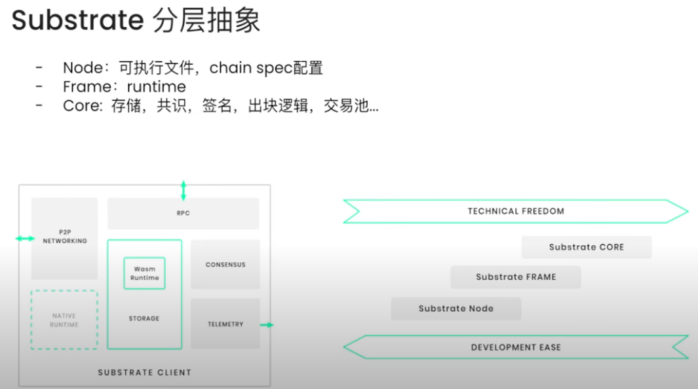


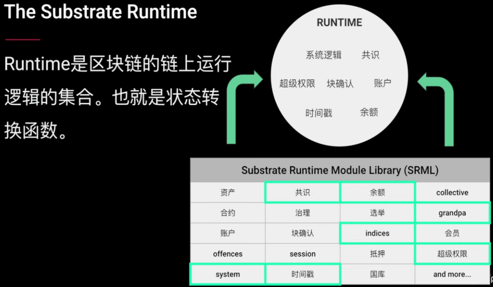


### 启动节点

库

```
https://github.com/papermoonio/polkadot-sdk-solo-template-dev-courses
```


实验运行环境 ubuntu22.04.3

安装rust

官网

```
https://www.rust-lang.org/learn/get-started
```

需要先配置代理，加入~/.profile  并source

```
export http_proxy="http://192.168.18.254:7890"
export https_proxy="http://192.168.18.254:7890"
```

下载安装脚本并安装

```
curl --proto '=https' --tlsv1.2 -sSf https://sh.rustup.rs | sh
```

使用1.标准安装

安装后提示要使当前shell环境变量生效

```
"$HOME/.cargo/env"            # For sh/bash/zsh/ash/dash/pdksh
source "$HOME/.cargo/env.fish"  # For fish
```


安装后查看cargo版本

```
cargo --version
显示
cargo 1.79.0 (ffa9cf99a 2024-06-03)
```


```
mkdir /workspace
cd  /workspace
git clone https://github.com/papermoonio/polkadot-sdk-solo-template-dev-courses.git
cd polkadot-sdk-solo-template-dev-courses
git checkout polkadot-v1.10.0
cargo build --release
```

编译报错

```
error: linker `cc` not found
```

需要c的编译器

```
sudo apt-get update
sudo apt-get install build-essential
```

编译报错找不到protoc

```
apt-get install protobuf-compiler
```

编译报错找不到libclang.so

```
apt-get install	clang
```


编译好后在  .target/release下有节点执行文件 solochain-template-node

```
cd /target/release
```

查看节点启动参数

```
./solochain-template-node --help |more

常用参数
purge-chain  清空链，重开新链
--validator  启用验证者节点模式，才能有出块权
--base-path  和btc的--datadir 类似，指定区块数据存储目录，可以用来保留多个链的数据
--chain dev   指定以开发者模式启动链，dev开发者模式可以不形成p2p网络单节点就能出块，local模式需要至少2个节点
--tmp   测试常用，每次运行完当前链自动清空数据，以省略用purge-chain清空的步骤
```

内建链名的快捷参数

```
节点程序内建了一些默认名称以便于快捷使用
      --alice
          Shortcut for `--name Alice --validator`.
          Session keys for `Alice` are added to keystore.
          
--alice   相当于 --name Alice --validator   并且添加了一个Alice的 Session keys
可以使用
./solochain-template-node key inspect //Alice --scheme sr25519   查看key，注意这里 Alice 区分大小写

还有
bob
charle
dave
eve等

```

启动名字叫bob节点

```
screen -S bob
./solochain-template-node  --bob --chain=local --tmp
```


在bob节点启动信息中找到identity 标识，用来让别的节点连接时使用

```
Local node identity is: 12D3KooWRsS72eow6MVPiqJorYZCTz2AQQCHwJAvd5AUCtiHwZ2B
```


启动eve节点并让eve节点连接bob节点,此时就组成了p2p网络可以看到出块了

```
screen -S eve
./solochain-template-node  --eve --chain=local --tmp --bootnodes /ip4/127.0.0.1/tcp/30333/p2p/12D3KooWRsS72eow6MVPiqJorYZCTz2AQQCHwJAvd5AUCtiHwZ2B
```


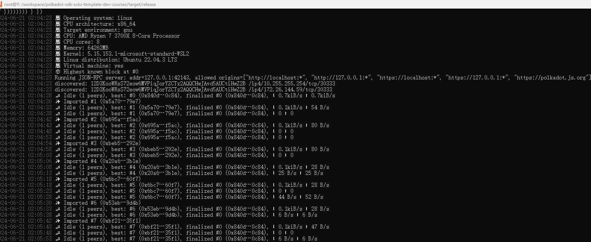


用build--spec将一条链的初始参数导出到json文件

默认一条链是带默认bootnode节点数据的可以用--disable-default-bootnode  清除

```
./solochain-template-node  build-spec --chain=local --disable-default-bootnode >chainOne.json
```


配置文件信息

```
balance可以指定一些账户的创世余额，相当于预挖部分

其中aura是区块生成相关配置
其中grandpa数据段是数据一致性配置信息

aura中的authorities是可信验证者的Public key (SS58)
```


生成新账户

```
./solochain-template-node key generate
```


以内置账户Charlie为种子生成key，这里Charlie区分大小写，--scheme指定签名算法，一般aura部分使用sr25519

```
./solochain-template-node key inspect //Charlie --scheme sr25519
生成结果
Secret Key URI `//Charlie` is account:
  Network ID:        substrate
  Secret seed:       0xbc1ede780f784bb6991a585e4f6e61522c14e1cae6ad0895fb57b9a205a8f938
  Public key (hex):  0x90b5ab205c6974c9ea841be688864633dc9ca8a357843eeacf2314649965fe22
  Account ID:        0x90b5ab205c6974c9ea841be688864633dc9ca8a357843eeacf2314649965fe22
  Public key (SS58): 5FLSigC9HGRKVhB9FiEo4Y3koPsNmBmLJbpXg2mp1hXcS59Y
  SS58 Address:      5FLSigC9HGRKVhB9FiEo4Y3koPsNmBmLJbpXg2mp1hXcS59Y
```


编辑chainOne.json添加可信验证者到aura部分

```
 "aura": {
          "authorities": [
            "5GrwvaEF5zXb26Fz9rcQpDWS57CtERHpNehXCPcNoHGKutQY",
            "5FHneW46xGXgs5mUiveU4sbTyGBzmstUspZC92UhjJM694ty",
            "5FLSigC9HGRKVhB9FiEo4Y3koPsNmBmLJbpXg2mp1hXcS59Y"
          ]
```

生成ed25519签名算法地址

```
./solochain-template-node key inspect //Charlie --scheme ed25519
结果
Secret Key URI `//Charlie` is account:
  Network ID:        substrate
  Secret seed:       0x072c02fa1409dc37e03a4ed01703d4a9e6bba9c228a49a00366e9630a97cba7c
  Public key (hex):  0x439660b36c6c03afafca027b910b4fecf99801834c62a5e6006f27d978de234f
  Account ID:        0x439660b36c6c03afafca027b910b4fecf99801834c62a5e6006f27d978de234f
  Public key (SS58): 5DbKjhNLpqX3zqZdNBc9BGb4fHU1cRBaDhJUskrvkwfraDi6
  SS58 Address:      5DbKjhNLpqX3zqZdNBc9BGb4fHU1cRBaDhJUskrvkwfraDi6
```

编辑chainOne.json添加可信验证者到grandpa部分

```
"grandpa": {
          "authorities": [
            [
              "5FA9nQDVg267DEd8m1ZypXLBnvN7SFxYwV7ndqSYGiN9TTpu",
              1
            ],
            [
              "5GoNkf6WdbxCFnPdAnYYQyCjAKPJgLNxXwPjwTh6DGg6gN3E",
              1
            ],
              [
              "5DbKjhNLpqX3zqZdNBc9BGb4fHU1cRBaDhJUskrvkwfraDi6",
              1
            ]          
            
          ]
        },
```

然后将配置文件转换成原生格式,此时会进行json格式校验

```
./solochain-template-node build-spec --chain=chainOne.json --disable-default-bootnode --raw > rawChainOne.json
```

使用rawjson启动配置好参数的节点

```
screen -S alice
./solochain-template-node --alice --chain=rawChainOne.json --tmp
节点id
 Local node identity is: 12D3KooWECHgv1dR6paPPhC9oZ1i5xyBTsxEoXn5Vxff5SF8hm4s
```


根据拜占庭共识由于区块设置了3个验证者，此时之启动两个节点，虽然可以生成区块但是区块确认finalized一直停留在0

需要启动第三个节点才能确认区块

```
screen -S bob
./solochain-template-node  --bob --chain=rawChainOne.json --tmp --bootnodes /ip4/127.0.0.1/tcp/30333/p2p/12D3KooWECHgv1dR6paPPhC9oZ1i5xyBTsxEoXn5Vxff5SF8hm4s

screen -S dave
./solochain-template-node  --dave --chain=rawChainOne.json --tmp --bootnodes /ip4/127.0.0.1/tcp/30333/p2p/12D3KooWECHgv1dR6paPPhC9oZ1i5xyBTsxEoXn5Vxff5SF8hm4s

```


前端钱包，选择local testnet默认连接127.0.0.1:9944

```
https://polkadot.js.org/apps/?rpc=ws%3A%2F%2F127.0.0.1%3A9944#/explorer
```


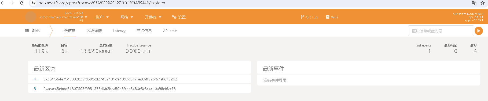


### substrate 基础原理

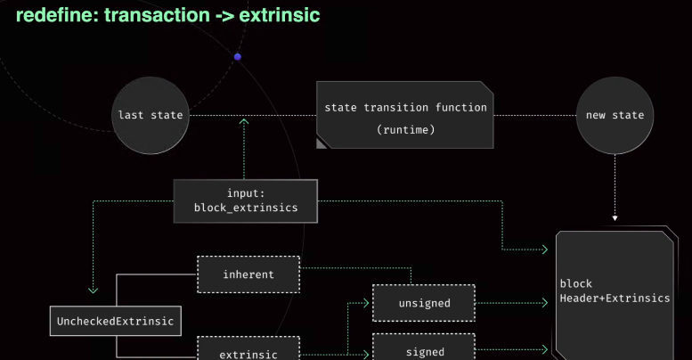


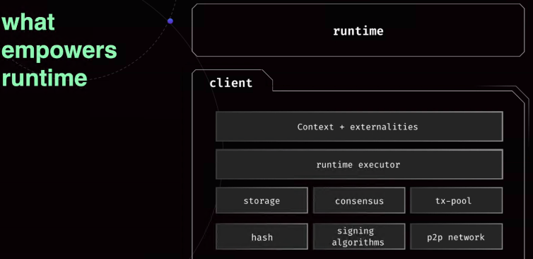


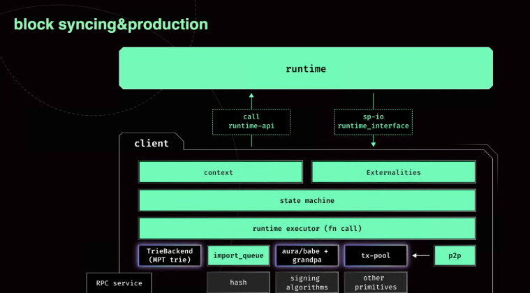


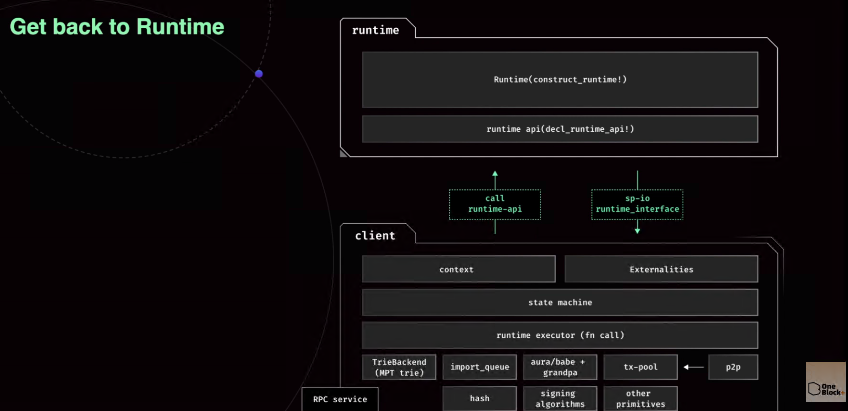


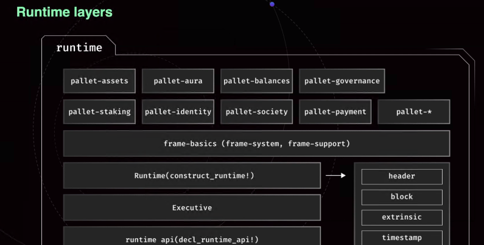


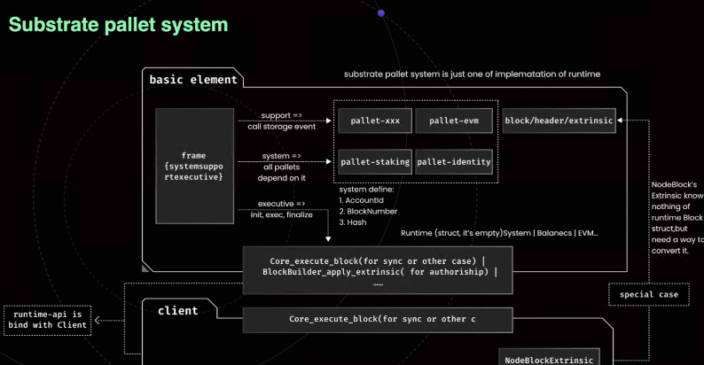


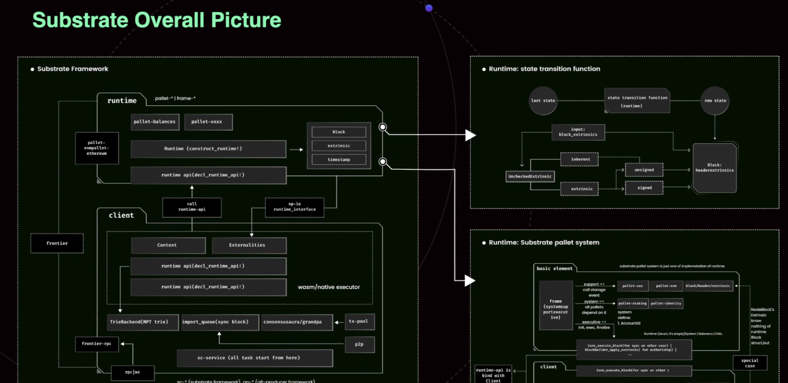


### 课程资料链接

Substrate入门课第15期学员手册

```
https://www.notion.so/Substrate-15-3fe8100f60844a0d8842d950a40e6aa9?pvs=4
```

课前预习资料

```
https://www.notion.so/872ffb83c8c744ed84f77c00a0d15363?pvs=4
```

学员评分表

```
https://www.notion.so/sub-15-627e9073fefb4c0dbca7401f6df03686?pvs=4
```

课程视频列表

```
https://www.youtube.com/playlist?list=PLKgwQU2jh_H96u8lOc2oe-GOgDg7OYrkB
```

第一个作业

```
https://github.com/papermoonio/substrate-primary-15-homework/blob/main/homework-1/README.md
```

