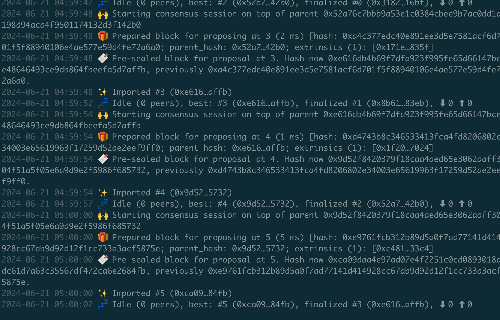
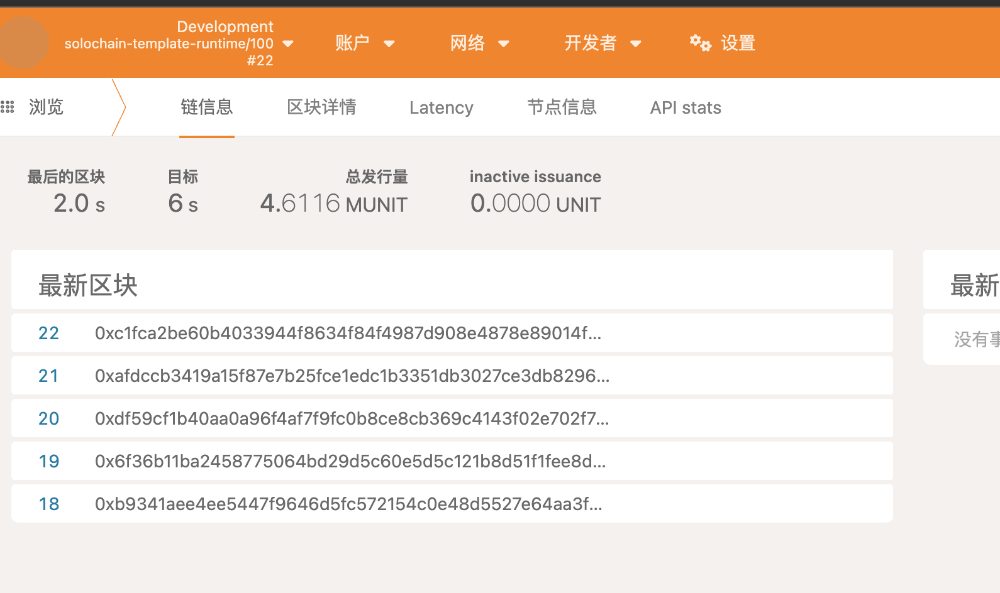

# homework-1

## 白皮书 utxo理解

utxo 模型是 Unspent Transaction Output 解释为：未花费的交易输出。

其主要记录的是交易事件，发生确认后就记录。然后用户根据交易事件来计算最终自己的余额。
例子是 A 有10的资产，给B 2 个，给 c 5 个剩余的 A 自己 3 个，那么交易为：

- 输入
  - A 的utxo 是10
- 输出
  - 给 B  2
  - 给 C 5
    - 剩余自己 A 3

最终A 的uxto 会被标记为花完。 并生成为新的utxo:

- B 2
- C 5
- A 3

utxo 模型包括输入，输出。输入引用之前的未花费输出（utxo），而输出成新的utxo

当交易被确认后，其输出被记录为utxo，每个utxo都有金额和地址
花费utxo 就是引用它作为新交易的输入。此时utxo被标记为花费，并从utxo集合中移除。
这里就是所有的交易都可向前去找之前的交易。
验证交易时，节点会检查所有输入是否都有效且未被花费，并确认输入金额总和大于等于输出金额总和。

## 运行solochain-template-node节点

## address

1632kDrmjZMh8VaAQ5jAUyAfUVCCge981z7MHL6zXSbSxYYo

## RS

- Unspent transaction output
    <https://en.wikipedia.org/wiki/Unspent_transaction_output>
- <https://developer.bitcoin.org/devguide/block_chain.html>
