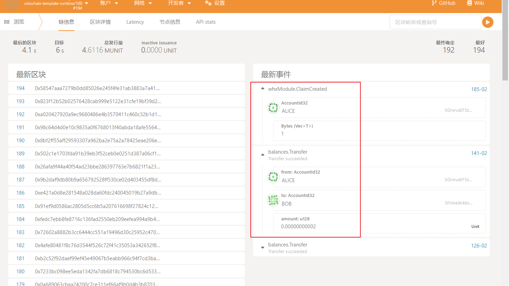

# React + Vite

This template provides a minimal setup to get React working in Vite with HMR and some ESLint rules.

Currently, two official plugins are available:

- [@vitejs/plugin-react](https://github.com/vitejs/vite-plugin-react/blob/main/packages/plugin-react/README.md) uses [Babel](https://babeljs.io/) for Fast Refresh
- [@vitejs/plugin-react-swc](https://github.com/vitejs/vite-plugin-react-swc) uses [SWC](https://swc.rs/) for Fast Refresh

```js
//下载依赖
npm i
```

# 使用polkadot js api来写一个具备基础功能的钱包
效果展示


## 1.新建账户，显示余额
```js
//根据用户输入的助记词生成地址
const keyring = new Keyring({ type: 'sr25519' });
const account = keyring.addFromUri(mnemonicInput);
```


## 转账交易功能

根据第五周课程新建的pollet 存证模块whxModule进行测试

```js
 const tx = api.tx.whxModule.createClaim(0x1)
```
